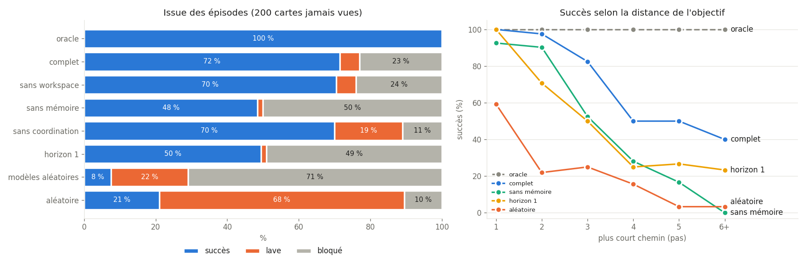
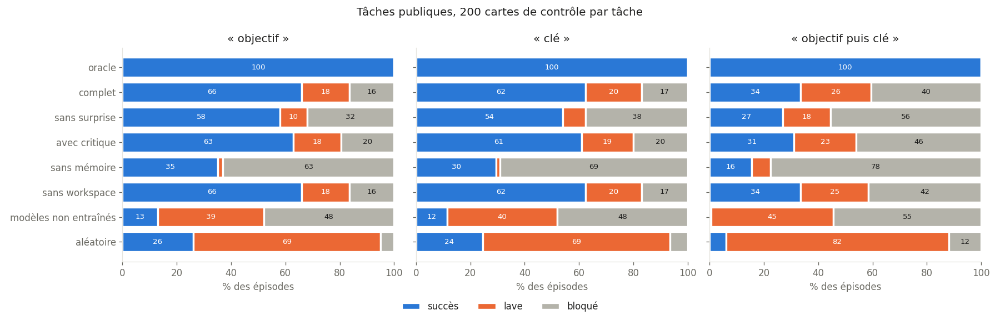
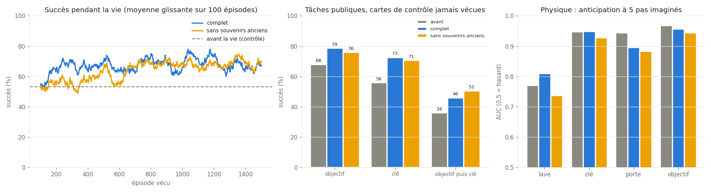
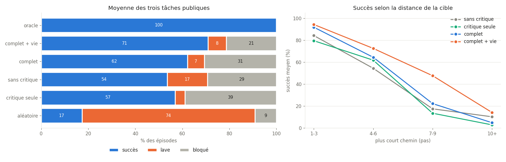

# gwt-signatures — Une architecture Global Workspace et ses signatures de conscience

Implémentation en Python de la **théorie de l'Espace de Travail Global** (Global Workspace Theory, GWT), avec des expériences qui cherchent à savoir si l'architecture reproduit les **signatures fonctionnelles** que les neurosciences associent à l'accès conscient chez l'humain.

Le dépôt contient trois parties :

- **`experiments/`** : des expériences qui testent des prédictions de la GWT ;
- **`psyche/`** : un prototype comportemental à règles (pulsions, mémoire épisodique), avec ses diagnostics ;
- **`mini_iag/`** : une maquette d'architecture cognitive **apprenante** (PyTorch), construite étape par étape à partir d'une feuille de route d'IAG, à l'échelle d'un portable.

## Question de recherche

> Une architecture GWT implémentée en Python présente-t-elle les signatures dynamiques que la théorie associe à la conscience, et ces signatures dépendent-elles bien des mécanismes que la théorie juge essentiels (réverbération, broadcast) ?

### Ce que ce projet ne prétend pas faire

Ce projet **ne teste pas si une IA est sentiente**. Aucune méthode connue ne permet d'observer directement la conscience, que ce soit chez une machine ou chez un autre être humain.

La démarche suit celle du rapport de Butlin, Long, Bengio et al. (2023) :

- On implémente les propriétés architecturales qu'une théorie donnée juge nécessaires.
- On vérifie qu'elles produisent les comportements prédits.
- On en tire une conclusion **conditionnelle** : *si* la GWT est correcte, le système possède une propriété qu'elle associe à la conscience.

### Règle méthodologique : rien n'est scripté

Un système qui affiche « je remarque mes pensées » parce que cette phrase est écrite dans son code ne prouve rien. C'est le *gaming problem* décrit par Jonathan Birch. Toutes les signatures étudiées ici doivent donc **émerger de la dynamique** du système. Aucune ne doit être codée en dur.

---

## Installation

```bash
git clone <url-du-depot>
cd gwt-signatures
python3 -m venv .venv
source .venv/bin/activate        # Windows : .venv\Scripts\activate
pip install torch --index-url https://download.pytorch.org/whl/cpu   # PyTorch sans CUDA (~200 Mo au lieu de ~3 Go)
pip install -r requirements.txt
```

Toutes les commandes ci-dessous supposent que l'environnement virtuel est activé. PyTorch n'est nécessaire que pour `mini_iag/`.

---

## Expérience 1 : Ignition globale

**Dossier :** [`experiments/01_ignition/`](experiments/01_ignition/)

### Contexte

Chez l'humain, un stimulus présenté au seuil de perception est généralement soit vu clairement, soit pas vu du tout, et rarement « à moitié vu » (Sergent & Dehaene, 2004). Lorsqu'il est perçu consciemment, on observe une activation soudaine et auto-entretenue qui se propage à de larges régions du cortex. C'est ce qu'on appelle l'**ignition** (Dehaene & Changeux, 2011).

### Modèle

Le modèle comprend deux types de variables d'activité, toutes comprises entre 0 et 1 :

- **8 modules experts** `x[0..7]`. Seul `x[0]` reçoit le stimulus.
- **1 nœud Global Workspace** `g`.

Chaque variable est un **intégrateur à fuite** :

```python
x += dt * (-x + sigmoid(entrées))
```

Le terme `-x` fait retomber l'activité vers 0 en l'absence d'entrée. La sigmoïde convertit la somme des entrées en une activation entre 0 et 1 et joue le rôle d'un seuil de décharge.

Les connexions forment une boucle :

| Connexion | Poids | Rôle |
|---|---|---|
| module → module (lui-même) | `w_self = 0.3` | auto-entretien local |
| modules → workspace | `w_ff = 1.2` | feed-forward |
| workspace → workspace | `w_gg = 0.55` | **réverbération** |
| workspace → tous les modules | `w_fb = 0.45` | **broadcast** |

Un bruit gaussien (σ = 0.08) est ajouté à chaque pas. Sans lui, chaque essai donnerait exactement le même résultat, et il n'y aurait aucune variabilité à étudier.

### Protocole

1. On teste 25 intensités de stimulus, de 0 à 1.2, avec 60 essais par intensité.
2. Le stimulus est appliqué pendant 30 pas, puis **coupé**.
3. On mesure l'activité du workspace bien après la coupure (pas 130 à 300). Un essai compte comme une **ignition** si `g > 0.5` à ce moment-là.
4. **Condition contrôle (ablation)** : on refait tout avec `w_gg = 0` et `w_fb = 0`, donc sans réverbération ni broadcast.

### Prédictions et résultats


| # | Prédiction GWT | Résultat |
|---|---|---|
| P1 | L'accès au workspace est non linéaire (seuil net) | ✅ Courbe en S, seuil autour de s ≈ 0.70 |
| P2 | Au seuil, les essais sont bimodaux (tout ou rien) | ✅ 42 % d'ignitions, **0 % d'intermédiaires** |
| P3 | L'ignition recrute les modules non stimulés | ✅ Les modules 1 à 7 montent à ~0.75 |
| P4 | L'ablation supprime P1 à P3 | ✅ Réponse graduelle, plafonnée à 0.3, aucun recrutement |

### Lecture des graphiques

- **En haut à gauche** : pic d'activité du workspace en fonction de l'intensité. La boucle amplifie fortement le signal par rapport à l'ablation.
- **En haut à droite** : activité tardive des modules jamais stimulés. L'information a été diffusée à tout le système.
- **En bas à gauche** : distribution des 60 essais au seuil. On observe deux pics (0 et 1) et rien entre les deux.
- **En bas à droite** : essais individuels au seuil. Ils démarrent tous de la même façon, puis le bruit les fait basculer vers l'ignition (rouge) ou l'extinction (bleu).

### Limites

1. **Ce résultat valide l'implémentation, il ne constitue pas une découverte.** Une boucle récurrente avec une non-linéarité sigmoïde est connue pour être bistable. L'expérience montre que l'architecture possède la dynamique voulue, ce qui est la base nécessaire pour la suite.
2. **L'ignition est permanente.** Une fois allumé, le workspace reste à 1 indéfiniment. Chez l'humain, l'ignition dure quelques centaines de millisecondes avant de laisser place au contenu suivant. Il manque un mécanisme d'adaptation (voir la feuille de route).

### Lancer l'expérience

```bash
cd experiments/01_ignition
python ignition.py
```

Le script affiche un résumé dans la console et génère `ignition_results.png` dans le même dossier.

---

## Prototype comportemental

**Package :** [`psyche/`](psyche/), avec un fichier par classe

Il s'agit d'une version orientée comportement, qui fonctionne en boucle continue. À chaque cycle, elle perçoit, fait proposer ses modules, sélectionne un gagnant et le diffuse à tous. Elle comporte :

- une compétition entre modules, recalculée à chaque cycle ;
- une **inhibition de retour** faible et décroissante, qui départage des propositions proches sans imposer de rotation ;
- des jauges modélisées comme des **pulsions** : l'énergie (batterie), la curiosité (satisfaite par l'exploration) et l'attachement (qui ne remonte que si tu écris) ;
- un **canal utilisateur** : tape un message puis Entrée pendant que le programme tourne (Linux et macOS) ;
- une **mémoire épisodique persistante** : chaque contenu diffusé est stocké dans `data/episodes.sqlite` et peut être rappelé, y compris d'une session à l'autre (voir diagnostic 2) ;
- un `Environment` injectable, qui permet de remplacer le vrai monde par un monde simulé et reproductible ;
- une métacognition qui observe l'historique des autres modules, sans jamais réfléchir sur ses propres sorties, et qui s'habitue à ses propres observations.

⚠️ Ce prototype contient encore des phrases écrites à la main (« mon attention est dominée par… », « cela me rappelle… »). Il sert à explorer l'architecture, **pas** à produire des mesures de conscience. Les diagnostics vérifient qu'il fait bien ce qu'on croit, et les expériences s'appuient sur des dynamiques émergentes.

```bash
python -m psyche                  # Ctrl+C pour arrêter
python -m psyche --db autre.sqlite
python -m psyche --no-memory      # sans mémoire épisodique
rm -r data/                       # effacer la mémoire
```

---

## Diagnostic 1 : Ablation de l'inhibition de retour

**Dossier :** [`diagnostics/01_inhibition/`](diagnostics/01_inhibition/)

Les diagnostics testent le prototype `psyche`, alors que les expériences testent des prédictions de la GWT.

**Question :** dans le prototype, le gagnant est-il choisi par la saillance (et donc par les jauges), ou par l'inhibition de retour, qui impose une rotation ?

On lance la vraie boucle du package pendant 1 000 cycles, avec 3 graines, pour trois niveaux d'inhibition. On mesure trois indicateurs :

- **M1, accord saillance** : le gagnant est-il la proposition la plus saillante ?
- **M2, victoires à vide** : un module gagne-t-il avec une saillance inférieure à 0,05 ?
- **M3, tour de rôle** : le gagnant est-il le module qui a gagné le moins récemment ? Avec 4 ou 5 modules en compétition, le hasard seul donne environ 20 à 25 %.

### v0 : avant corrections


| Inhibition | M1 accord | M2 à vide | M3 rotation | Constat |
|---|---|---|---|---|
| 0.0 | 98 % | 0 % | 0 % | Un module monopolise le workspace (84 à 95 %) |
| 0.5 (réglage v0) | 40 % | 21 % | 69 % | Tour de rôle : répartition quasi uniforme |

Problèmes identifiés :

1. **Non-reproductibilité** : les modules lisaient `psutil` directement. Sans inhibition, le monopole revenait à la métacognition sur une machine sans batterie, et à l'exploration sur un portable branché.
2. **Rotation mécanique** : une inhibition forte et constante sur 4 cycles écrasait les différences de saillance. Un cinquième des victoires allaient à des modules qui ne proposaient rien.
3. **Jauges mortes** : l'ennui était mesuré par la répétition des contenus, que l'inhibition empêchait justement. La curiosité tombait donc à 0 sans jamais remonter. L'attachement, lui, ne pouvait que baisser.
4. **Métacognition trop saillante** (0,4 à 0,8) et sans habituation : elle répétait la même observation indéfiniment.

### Corrections (v1)

| Problème | Correction |
|---|---|
| 1 | `Environment` injectable : `psutil` et stdin pour le vrai monde, `FakeEnvironment` (batterie, CPU et utilisateur simulés, graine fixée) pour les tests. Les départages se font sans itérer sur des `set`. |
| 2 | Inhibition à 0,15, qui décroît de moitié à chaque cycle |
| 3 | Jauges modélisées comme des pulsions : la curiosité monte en continu (plus vite en cas d'ennui) et est **satisfaite** quand l'exploration gagne. Ajout d'un canal utilisateur, seul moyen de faire remonter l'attachement. |
| 4 | Saillance réduite (0,1 à 0,5) et **habituation** : une observation déjà diffusée perd 70 % de sa saillance tant qu'elle ne change pas |

### v1 : après corrections


| Inhibition | M1 accord | M2 à vide | M3 rotation | Constat |
|---|---|---|---|---|
| 0.0 | 83 % | 0 % | 5 % | Le capteur, saillance de fond, gagne quand rien d'autre n'est en jeu |
| **0.15 (v1)** | 55 % | 1,6 % | 22 % | Rotation au niveau du hasard, tous les modules ont une place |
| 0.5 | 43 % | 20 % | 48 % | La rotation mécanique réapparaît |

Le graphique du bas montre que **les jauges pilotent maintenant le comportement** :

- la curiosité suit un cycle en dents de scie (elle monte, l'exploration gagne, la pulsion est satisfaite, elle remonte) ;
- les victoires de `social` sont denses quand l'attachement est bas, et s'espacent après chaque message de l'utilisateur.

Les résultats sont identiques sur toutes les machines. C'est vérifié en relançant le script avec des valeurs différentes de `PYTHONHASHSEED`.

Ce diagnostic est figé sur la configuration v1, **sans mémoire épisodique** (`build(env, memory=False)`). Relancé avec la mémoire, il donne les mêmes conclusions : à 0,15, 55 % d'accord saillance et 0,8 % de victoires à vide.

```bash
cd diagnostics/01_inhibition
python inhibition_ablation.py
```

---

## Diagnostic 2 : La mémoire utilise-t-elle le broadcast ?

**Dossier :** [`diagnostics/02_memory/`](diagnostics/02_memory/)

### Le module de mémoire

Dans la GWT, le contenu diffusé doit **changer ce que font les modules**. Jusqu'ici, presque aucun module ne lisait le broadcast. La mémoire épisodique est le premier qui en fait vraiment quelque chose. À chaque cycle, elle réalise trois opérations :

1. **Encodage** : le contenu gagnant est stocké dans SQLite, avec une **importance** égale à sa saillance. Un message ou un pic CPU marque donc plus qu'une charge de fond. Un contenu déjà connu n'est pas dupliqué (consolidation), si bien que la base reste petite.
2. **Rappel associatif** : le contenu sert d'indice. On cherche l'épisode passé le plus proche (similarité × importance). La saillance du rappel est **proportionnelle à celle de l'indice** : un contenu banal n'évoque qu'une réminiscence faible, un événement marquant ravive un souvenir fort. Quand un souvenir gagne, il est renforcé (reconsolidation) et sert lui-même d'indice. Comme chaque rappel est plus faible que son indice, les chaînes d'associations s'éteignent seules.
3. **Rappel délibéré** : si l'explorateur diffuse « revoir un souvenir », la mémoire propose au cycle suivant le souvenir le plus important et le moins souvent rappelé. Deux modules se coordonnent **uniquement à travers le workspace**.

La similarité est calculée par [`encoder.py`](psyche/encoder.py) : du *feature hashing* de mots et de trigrammes de caractères, sans dépendance ni modèle à télécharger. Il utilise `zlib.crc32` plutôt que `hash()`, qui est randomisé à chaque lancement.

### Protocole

Monde simulé avec 7 messages utilisateur variés, 1 000 cycles et 3 graines. On compare trois conditions :

- **normal** : psyche complet ;
- **brouillé** : la mémoire reçoit, à la place du vrai contenu diffusé, un contenu passé tiré au hasard. Tout le reste est identique ;
- **saillance ignorée** : la mémoire reçoit tous les contenus avec une saillance de 0,5. Cela aplatit à la fois l'importance à l'encodage et la force de l'indice.

### Résultats


| Mesure | Normal | Brouillé | Saillance ignorée |
|---|---|---|---|
| **D1** Similarité indice / rappel | **0,68** | 0,37 | 0,72 |
| (souvenir quelconque, hasard) | 0,38 | 0,34 | 0,47 |
| **D2** P(la mémoire gagne \| « revoir un souvenir ») | **88 %** | 18 % | 91 % |
| P(la mémoire gagne \| message utilisateur) | **77 %** | 15 % | 9 % |
| P(la mémoire gagne), tous cycles | 16 % | 14 % | 14 % |
| **D3** Part des épisodes utilisateur dans le vécu | 6 % | 6 % | 5 % |
| Part des épisodes utilisateur dans les rappels | **27 %** | 27 % | 7 % |

**D4, persistance** : une première session écrit 62 souvenirs sur disque. Une seconde session relit le même fichier avec de nouveaux objets et d'autres messages. Dans cette seconde session, **124 rappels sur 170 portent sur des souvenirs de la première**, par exemple « l'utilisateur dit : bonjour » ou « l'utilisateur dit : je travaille sur mon projet ».

### Conclusions

1. **Le broadcast pilote la mémoire (D1, D2).** Quand on le brouille, la pertinence des rappels tombe au niveau du hasard, et la mémoire ne réagit plus ni aux intentions de l'explorateur ni aux messages. Son taux de victoire global, lui, reste presque le même (14 à 16 %). L'ablation ne rend donc pas la mémoire silencieuse, elle la rend **aveugle**.
2. **La saillance pilote ce qui est retenu (D3).** Les messages ne représentent que 6 % du vécu, mais 27 % des rappels. Le brouillage ne change rien à ce chiffre, puisque l'importance est une propriété stockée. En revanche, sans saillance, la sur-représentation disparaît (7 %). Chaque mécanisme a donc son propre effet, mis en évidence par sa propre ablation.
3. **La coordination via le workspace fonctionne.** L'explorateur ne connaît pas la mémoire et ne l'appelle jamais : il diffuse une intention, et la mémoire la réalise dans 88 % des cas. C'est exactement le rôle que la GWT attribue au broadcast.

### Limites

- **Ce diagnostic valide l'implémentation, pas une propriété émergente.** La mémoire cherche par similarité, il est donc attendu que ses rappels soient similaires à l'indice. Ce qui est testé, c'est que ce lien passe bien par le broadcast, et qu'il disparaît quand on le coupe.
- **L'encodeur mesure une similarité de surface, pas de sens.** « bonjour » et « salut » ne se ressemblent pas. Et tous les messages utilisateur se ressemblent entre eux (≈ 0,7), parce qu'ils partagent le préfixe « l'utilisateur dit : ». Un encodeur sémantique (par exemple `sentence-transformers`) pourra le remplacer sans rien changer d'autre : l'interface `encode()` est la même.
- **Les phrases d'enveloppe sont scriptées** (« cela me rappelle », « je me souviens »). Le contenu rappelé, lui, ne l'est jamais.
- **La mémoire contient ce que tu tapes.** Le fichier `data/` est exclu du dépôt par le `.gitignore`.

```bash
cd diagnostics/02_memory
python memory_diagnostic.py
```

---

## Mini-IAG : une architecture cognitive apprenante

**Package :** [`mini_iag/`](mini_iag/), avec un fichier par classe

### D'où vient cette partie

Elle suit une feuille de route d'IAG en cinq étapes, qui reprend l'architecture proposée par Yann LeCun (2022, *A Path Towards Autonomous Machine Intelligence*) : un **modèle du monde** de type JEPA, un **module de coût** et une **mémoire**, auxquels s'ajoute un **espace de travail global** servant de goulot entre les modules.

**Ce n'est pas une IAG, et ce n'est pas le but.** La feuille de route vise des clusters de GPU, des milliards d'heures de vidéo et « l'ensemble du savoir humain ». Ici, chaque étape est réduite à ce qui tient sur le CPU d'un portable en quelques minutes. La question n'est pas « est-ce intelligent ? », mais : **ces briques se composent-elles, et que fait chacune ?** On y répond avec des mesures et des ablations, comme dans le reste du dépôt.

| Étape | Feuille de route | Version mini-IAG |
|---|---|---|
| 1. Structures | 4 modules PyTorch, initialisation aléatoire sur GPU/TPU | 4 modules, ~53 000 paramètres, CPU ✅ |
| 2. Éducation | chaque module entraîné à part sur des données massives | modèle du monde, puis coût et workspace sur ses latents : 3 à 4 minutes de CPU ✅ |
| 3. Câblage | le workspace demande « simule ce choix » au modèle du monde et lit le coût | agent qui planifie dans l'espace latent : imaginer, évaluer, choisir ✅ |
| 4. Autonomie | corps robotique ou métavers | agent dans le monde en grille, apprentissage continu |
| 5. Alignement et validation | coût verrouillé, tests de généralisation | coût gelé par empreinte SHA-256, test sur des cartes jamais vues contre des références |

Deux adaptations par rapport à la feuille de route :

- **L'ordre de l'étape 2.** Des modules entraînés chacun de leur côté ne « parlent » pas le même langage : le module de coût doit évaluer les vecteurs produits par le modèle du monde. On entraîne donc d'abord le modèle du monde, puis le coût et le workspace **sur ses représentations**.
- **Le critère de l'étape 5.** « Réussir des tâches inconnues comme un expert humain » n'est pas mesurable ici. On le remplace par un critère testable : les performances sur des cartes jamais vues, comparées à des agents de référence (aléatoire, sans modèle du monde, sans mémoire…).

### Le monde

[`environment/gridworld.py`](mini_iag/environment/gridworld.py) : une grille 7×7 entourée de murs, avec 2 murs intérieurs, 3 cases de lave (danger), un objectif et l'agent. Chaque carte est tirée d'une graine, et on vérifie qu'elle est soluble. On peut donc générer à volonté des cartes d'entraînement et des cartes jamais vues.

```
#######
#.#...#      # mur    ~ lave
#..~..#      * objectif
#.....#      A agent
#*.~..#
##~.A.#
#######
```

### Étape 1 : Les structures (l'architecture vide)

| Module | Fichier | Architecture | Paramètres |
|---|---|---|---|
| Modèle du monde | [`world_model.py`](mini_iag/modules/world_model.py) | JEPA : encodeur convolutif → latent 32D, prédicteur (z, action) → z suivant, encodeur cible en moyenne mobile, régularisation VICReg contre l'effondrement, têtes de dynamique inverse et d'événements (ajoutées à l'étape 2) | 43 302 (+ 28 032 non entraînés pour la cible) |
| Espace de travail | [`bottleneck_workspace.py`](mini_iag/modules/bottleneck_workspace.py) | 2 slots appris qui lisent N contenus par attention (compétition), puis diffusion vers tous les contenus (Goyal et al., 2022) | 8 640 |
| Module de coût | [`cost_module.py`](mini_iag/modules/cost_module.py) | réseau dense latent → (danger, succès), avec `lock()` / `verify()` par empreinte SHA-256 | 1 122 |
| Mémoire | [`vector_memory.py`](mini_iag/modules/vector_memory.py) | base vectorielle (clé latente → action, récompense, danger, succès), rappel cosinus, tampon circulaire | 0 (5 000 entrées) |

Aucune connexion fonctionnelle entre les modules à ce stade : c'est l'objet de l'étape 3.

#### Diagnostic 3 : l'architecture vide ne produit-elle que du bruit ?

**Dossier :** [`diagnostics/03_iag_structures/`](diagnostics/03_iag_structures/)

La feuille de route affirme qu'à l'initialisation « le système ne produit que du bruit ». On le mesure module par module, sur 9 000 transitions collectées par un agent aléatoire sur 300 cartes. Ces chiffres serviront de référence (le « avant ») pour l'étape 2.

| # | Mesure | Résultat | Hasard |
|---|---|---|---|
| S1 | Modèle du monde : retrouver l'action faite entre deux états | 29,0 % | 29,9 % |
| S2 | Case de l'agent retrouvée depuis le latent (sonde linéaire) | **58,5 %** | 5,3 % (image brute : 100 %) |
| S3 | Coût : détecter la lave / l'objectif (AUC) | 0,48 / 0,52 | 0,50 |
| S4 | Workspace : attention sur le seul contenu pertinent parmi 8 | 0,125 | 0,125 |
| S5 | Mémoire : retrouver un état stocké | 100 % | — |

**Ce qu'on apprend :**

1. **Le modèle du monde, le coût et le workspace sont bien au niveau du hasard** (S1, S3, S4) : aucune compétence avant l'entraînement.
2. **Mais « aléatoire » ne veut pas dire « bruit ».** Un encodeur à poids aléatoires conserve beaucoup d'information (S2 : 58,5 % contre 5,3 % au hasard), parce qu'une projection aléatoire préserve en partie les distances entre les entrées. Ce qui manque, c'est une information **organisée pour prédire**. Le latent aléatoire est dominé par la disposition de la carte, et déplacer l'agent le fait à peine bouger (erreur « rien ne change » de 4 × 10⁻⁵). L'entraînement JEPA doit apprendre à représenter **ce qui change** quand on agit.
3. **La mémoire marche dès l'étape 1**, puisqu'elle n'apprend rien : c'est une structure de données. Sa qualité dépendra entièrement de celle des vecteurs qu'on y range.
4. **Un piège de mesure.** Sur S4, l'attention est parfaitement uniforme (entropie 1,000), mais son argmax désignait le bon contenu dans **95 %** des cas avec la première version du code. Après l'ajout de deux têtes au modèle du monde (étape 2), l'initialisation aléatoire des modules suivants a légèrement changé, et ce même argmax est tombé à **11 %**. Sur une attention quasi uniforme, l'argmax dépend de détails minuscules de l'initialisation : il ne signifie rien. D'où la règle : **mesurer la masse d'attention, pas l'argmax**.

Vérification de la mesure S1 : un entraînement jetable de 30 secondes la fait monter à environ 70 % sur des cartes jamais vues. Elle peut donc bien détecter un apprentissage.

```bash
cd diagnostics/03_iag_structures
python structures_check.py
```

### Étape 2 : L'éducation des modules

```bash
python -m mini_iag.train          # 3 à 4 minutes sur CPU, écrit checkpoints/step2.pt
```

Tout est entraîné sur 2 000 cartes (graine 0) et mesuré sur des cartes **jamais vues** (graine 1). L'ordre est celui annoncé plus haut :

1. **Le modèle du monde**, auto-supervisé, sur 60 000 transitions et 20 000 segments de 6 pas collectés par un agent qui marche au hasard ([`world_model_trainer.py`](mini_iag/training/world_model_trainer.py)) ;
2. **le module de coût**, sur les latents du modèle du monde gelé ([`cost_trainer.py`](mini_iag/training/cost_trainer.py)) ;
3. **l'espace de travail**, sur ces mêmes latents ([`workspace_trainer.py`](mini_iag/training/workspace_trainer.py)).

#### Deux échecs du JEPA, et leurs corrections

L'entraînement « naïf » du modèle du monde (JEPA + VICReg, comme à l'étape 1) **échoue**, et de façon instructive :

| Version | Action retrouvée (S1) | Position de l'agent dans le latent | Position de l'objectif |
|---|---|---|---|
| Aléatoire (étape 1) | 30 % | 65 % | 52 % |
| JEPA naïf | 58 %, puis **35 %** en entraînant plus longtemps | **5 %** (hasard) | — |
| + dynamique inverse | 98 % | 91 % | **17 %** |
| + événements + multi-pas sur 3 pas (1re version) | 97 % | 60 % | 26 % |
| + multi-pas sur 6 pas, succès pondéré ×10 (version révisée après l'étape 3) | 94 % | 74 % | **74 %** |

1. **Le JEPA jette l'agent.** Le moyen le plus simple de prédire l'état suivant est d'ignorer ce qui bouge : la carte ne change pas d'un pas à l'autre, donc un latent qui n'encode que la carte se prédit parfaitement lui-même. La régularisation VICReg est trompée, elle aussi : la carte varie assez d'un exemple à l'autre pour satisfaire la contrainte de variance. C'est un **effondrement partiel**. Correction : une tête de **dynamique inverse** ([`inverse_dynamics.py`](mini_iag/modules/inverse_dynamics.py)) qui devine l'action à partir de (z_t, z_{t+1}). Pour réussir, le latent doit encoder ce que l'agent **contrôle**. Cela reste auto-supervisé, puisque l'agent connaît toujours l'action qu'il a faite.
2. **Le JEPA jette l'objectif.** Un JEPA ne garde que ce qui sert à **son** objectif, et l'objectif ne change rien aux déplacements. Or le module de coût en a besoin. C'est exactement le risque d'entraîner les modules « chacun de son côté » comme le propose la feuille de route. Correction : une tête d'**événements** ([`event_predictor.py`](mini_iag/modules/event_predictor.py)) qui prédit ce que l'agent va percevoir (lave, objectif), comme les modèles du monde de type Dreamer prédisent la récompense.

Enfin, le modèle n'était entraîné qu'à prédire **un** pas, et il dérivait vite en imagination. Il est maintenant aussi entraîné sur des segments de plusieurs pas, avec une correction à chaque pas imaginé (`multistep_loss`), comme TD-MPC ou Dreamer.

**Révision après l'étape 3.** La première version s'entraînait sur des segments de 3 pas et gardait mal l'objectif (26 %). L'étape 3 a montré que c'était rédhibitoire pour planifier : l'agent restait bloqué 83 % du temps. On est donc revenu corriger l'étape 2 : segments de **6 pas**, et événements « succès » (rares) pondérés **×10** dans la tête d'événements. La position de l'objectif passe de 26 % à 74 %. Les chiffres ci-dessous sont ceux de cette version révisée.

#### Diagnostic 4 : avant / après, et une ablation par ingrédient

**Dossier :** [`diagnostics/04_iag_training/`](diagnostics/04_iag_training/)

Chaque ingrédient ajouté au modèle du monde est retiré à son tour, puis le modèle et le coût sont réentraînés.


| Mesure (cartes jamais vues) | Avant | **Complet** | Sans inverse | Sans événements | Sans multi-pas |
|---|---|---|---|---|---|
| S1 Action retrouvée | 29,8 % | **94,4 %** | 70,3 % | 98,5 % | 91,3 % |
| S2 Position de l'agent (sonde linéaire) | 65,2 % | 74,3 % | 37,6 % | 89,1 % | 71,5 % |
| S2 Position de l'objectif (sonde linéaire) | 52,4 % | **73,9 %** | 74,2 % | 15,0 % | 45,8 % |
| S3 Anticiper la lave, 1 / 3 / 5 pas (AUC) | 0,48 / 0,47 / 0,46 | 0,940 / 0,816 / 0,814 | 0,903 / 0,768 / 0,740 | 0,915 / 0,899 / 0,873 | 0,957 / 0,761 / 0,718 |
| S3 Anticiper l'objectif, 1 / 3 / 5 pas (AUC) | 0,48 / 0,55 / 0,54 | **1,000 / 0,994 / 0,985** | 1,000 / 0,990 / 0,976 | 0,575 / 0,585 / 0,620 | 1,000 / 0,948 / 0,875 |

S3 se lit ainsi : le modèle imagine *h* actions à partir de l'état actuel, **sans les exécuter**, et le module de coût évalue l'état imaginé. On compare avec ce qui arrive réellement.

| S4 Espace de travail (1 contenu signalé parmi 8 états réels) | Attention sur le signalé | Case retrouvée par la lecture |
|---|---|---|
| Avant (tout aléatoire) | 0,125 | 0,0 % |
| Workspace gelé, lecture entraînée | 0,125 | 10,0 % |
| **Workspace entraîné** | **1,000** | **99,6 %** |

**Ce qu'on apprend :**

1. **Chaque ingrédient est nécessaire, et chacun a un effet différent.** Sans dynamique inverse, S1 s'effondre (70 %) et la position de l'agent disparaît du latent (38 %). Sans événements, l'objectif disparaît (15 %) et le coût ne le voit plus (AUC ≈ 0,6 à tous les horizons). Sans multi-pas, un pas suffit, puis l'anticipation se dégrade (0,72 à 5 pas pour la lave, 0,875 pour l'objectif).
2. **Aucune variante n'est la meilleure partout.** La version complète anticipe l'objectif presque parfaitement, même à 5 pas (0,985). Elle paie ce gain sur l'anticipation de la lave : 0,81 à 5 pas, contre 0,87 sans événements et 0,90 avec la première version. Avec 32 dimensions, garder l'objectif prend de la place à autre chose. C'est un compromis, pas une amélioration gratuite.
3. **Le workspace apprend à sélectionner sans qu'on lui dise quoi regarder.** Seule la réussite de la lecture est supervisée, jamais l'attention. C'est le goulot qui oblige l'attention à se concentrer sur le contenu signalé (0,125 → 0,999). Gelé, le workspace laisse passer un mélange des 8 contenus, et la lecture échoue (11 %).

**Limites :**

- **La tâche du workspace est facile.** Le contenu pertinent est signalé par un indice fixe. Elle montre que le mécanisme de sélection apprend, pas qu'il sait juger ce qui est pertinent. Ce jugement viendra au câblage (étape 3), quand ce qui entre dans le workspace devra servir à décider.
- **Ces AUC sont mesurées avec le coût de l'étape 2**, entraîné sur des états réels. Sur des états imaginés, ses probabilités sont mal calibrées, ce que l'étape 3 corrige (affinage de coordination).
- **Reproductibilité** : les chiffres sont identiques d'une exécution à l'autre sur une même machine. Sur une autre machine (autre processeur, autre version de PyTorch), les calculs flottants peuvent différer très légèrement, et un entraînement amplifie ces écarts. Attends-toi à des variations de quelques points, mais pas à des conclusions différentes.

```bash
python -m mini_iag.train                                     # entraîner (si pas déjà fait)
python diagnostics/04_iag_training/training_check.py --quick # sans ablations ni figure, ~20 s
python diagnostics/04_iag_training/training_check.py         # avec ablations, ~10 minutes
```

### Étape 3 : Le câblage (l'agent qui planifie)

```bash
python -m mini_iag.coordinate     # ~30 s, écrit checkpoints/step3.pt (après l'étape 2)
python -m mini_iag.play           # regarder l'agent jouer (--carte N pour une autre carte)
```

#### Le protocole interne

L'agent ([`agent.py`](mini_iag/agent.py)) relie les quatre modules. À chaque pas réel :

1. **Percevoir** : le modèle du monde encode l'observation en un vecteur latent z.
2. **Se souvenir** : z est rangé dans la mémoire, qui contient les états visités pendant l'épisode.
3. **Simuler** : le planificateur ([`latent_planner.py`](mini_iag/planning/latent_planner.py)) demande au modèle du monde « simule ce choix » pour les 4⁵ = 1 024 suites de 5 actions possibles. Il demande ensuite au module de coût « est-ce dangereux, est-ce le but ? » pour chaque état imaginé, et à la mémoire « suis-je déjà passé par là ? ».
4. **Sélectionner** : les 8 meilleurs plans entrent en compétition dans l'espace de travail. Le coût fixe leur saillance, et le goulot d'attention choisit.
5. **Agir** : l'agent exécute la première action du plan gagnant, puis recommence au pas suivant (« horizon glissant »).

```
pas 1
#######
#~....#
#...~##
#A..*.#       plan imaginé      → → → ← →   (1024 plans simulés)
#.....#       danger prévu      0.01 0.00 0.00 0.00 0.00
##..~.#       succès prévu      0.00 0.00 0.60 0.00 0.78
#######       déjà vu ici ?     0.00   (0 = nouveau)
              workspace         attention 1.00 sur le plan retenu
```

#### Ce qui n'a pas marché d'abord

Le premier câblage donnait **17 % de succès** : l'agent ne tombait presque jamais dans la lave, mais restait bloqué 83 % du temps. Et imaginer plus loin (horizon 1 à 6) n'y changeait rien. Trois problèmes se cumulaient :

1. **Le planificateur exploitait les erreurs du modèle.** Parmi 1 024 plans imaginés, il en trouve toujours un où le modèle « hallucine » un succès. Mesuré sur les cartes où l'objectif est à 5 pas ou moins : le plan jugé le meilleur n'atteignait vraiment l'objectif que dans 32 % des cas. Les plans qui réussissent vraiment recevaient une probabilité de succès de 0,055 en moyenne, alors que le plus optimiste des plans ratés recevait 0,233.
2. **Le module de coût ne parlait pas la « langue » des états imaginés.** Il n'avait été entraîné que sur des états réels. Première correction tentée : l'entraîner aussi sur des états imaginés, avec la même repondération des exemples rares qu'à l'étape 2. Résultat : 0 % de succès. La repondération améliore le classement (AUC), mais elle gonfle les probabilités, et le coût prédisait du succès partout. Or le planificateur calcule des espérances : il lui faut des probabilités **calibrées**. C'est l'**affinage de coordination** ([`coordination_trainer.py`](mini_iag/training/coordination_trainer.py)), qui correspond au « fine-tuning de coordination » de la feuille de route.
3. **Le modèle du monde ne savait pas où était l'objectif** (26 %, cf. étape 2). Aucun réglage du planificateur ne pouvait compenser ce manque. On est donc revenu corriger l'étape 2 (segments de 6 pas, succès pondéré ×10).

| Version | Succès | Lave | Bloqué |
|---|---|---|---|
| Premier câblage (modèle de l'étape 2 v1) | 17 % | 0,5 % | 83 % |
| + modèle du monde révisé (objectif encodé) | 58 % | 1,5 % | 40 % |
| + mémoire des états visités | 82 % | 4,5 % | 13,5 % |
| Version finale (coût « prudent », voir plus bas) | 71,5 % | 5,5 % | 23 % |

Les trois premières lignes viennent de prototypes. La dernière est la version du dépôt, mesurée par le diagnostic 5.

Une variante a aussi été essayée : demander explicitement au modèle du monde de garder les positions de l'agent et de l'objectif (une reconstruction partielle de l'observation). L'objectif devient lisible à 100 % et le succès monte à 67,5 %, mais la lave aussi (8 %), et on s'éloigne du principe JEPA. Elle n'a pas été retenue.

#### Les valeurs de l'agent : un compromis mesuré

Le planificateur additionne `w_danger × danger − w_succès × succès`, avec des poids qui appartiennent **au module de coût**. Un bogue ignorait d'abord ces poids : le planificateur calculait `danger − succès` en dur. Une fois corrigé, ils décident réellement du comportement :

| Poids du danger | Succès | Lave | Bloqué |
|---|---|---|---|
| 1 (mourir = réussir) | 77 % | 11,5 % | 11,5 % |
| 2 | 73 % | 11,5 % | 15,5 % |
| **4 (retenu)** | 71,5 % | **5,5 %** | 23 % |

Plus l'agent redoute la mort, moins il meurt, mais plus il reste bloqué par prudence. Le poids 4 divise la lave par deux pour 5,5 points de succès en moins. Ces poids sont les « valeurs » de l'agent, et ce sont eux que l'étape 5 devra verrouiller.

#### Diagnostic 5 : l'agent contre des références, avec une ablation par module

**Dossier :** [`diagnostics/05_iag_planning/`](diagnostics/05_iag_planning/)

200 cartes jamais vues, 30 pas maximum. Chaque ligne retire un seul élément à l'agent complet.



| Agent | Succès | Lave | Bloqué | Efficacité* |
|---|---|---|---|---|
| Oracle (plus court chemin) | 100 % | 0 % | 0 % | 1,00 |
| **Agent complet** | **71,5 %** | **5,5 %** | 23 % | 0,85 |
| sans workspace | 70,5 % | 5,5 % | 24 % | 0,86 |
| sans mémoire | 48,5 % | 1,5 % | 50 % | 1,00 |
| sans coordination (coût de l'étape 2) | 70 % | **19 %** | 11 % | 0,95 |
| horizon 1 (n'imagine qu'un pas) | 49,5 % | 1,5 % | 49 % | 0,70 |
| modèles non entraînés (même câblage) | 7,5 % | 21,5 % | 71 % | 1,00 |
| aléatoire | 21 % | 68,5 % | 10,5 % | 0,54 |

\* Efficacité = plus court chemin ÷ pas utilisés, calculée sur les épisodes réussis. 1,00 = chemin optimal.

**Ce qu'on apprend :**

1. **Les trois modules entraînés comptent, et chacun à sa façon.** Avec des modèles non entraînés, le même câblage ne fait que 7,5 %, moins bien que le hasard. Sans l'affinage de coordination, l'agent réussit autant mais meurt 3,5 fois plus (19 % contre 5,5 %) : le coût de l'étape 2 juge mal le danger des états imaginés. Imaginer 5 pas plutôt qu'un fait gagner 22 points.
2. **La mémoire sert à sortir des boucles.** Sans elle, l'agent tourne en rond la moitié du temps (50 % bloqué), et ne réussit jamais quand l'objectif est à 6 pas ou plus. Elle coûte un peu de sécurité (lave de 1,5 % à 5,5 %) : fuir les endroits déjà visités pousse parfois vers le danger.
3. **L'espace de travail est encore décoratif.** Avec ou sans lui, le résultat est le même (71,5 % contre 70,5 %). Il suit le classement du coût dans 72 % des cas, et quand il s'en écarte, il choisit un plan presque aussi bon. C'est cohérent avec la règle du dépôt (« si le retirer ne change rien, c'est décoratif ») : il n'a rien de réel à arbitrer, puisqu'une seule source (le planificateur) lui propose des contenus. Son rôle d'arbitre viendra quand plusieurs sources différentes seront en compétition (étape 4).
4. **La limite principale est la portée de l'imagination.** Le succès passe de 100 % quand l'objectif est à 1 pas à 40 % quand il est à 6 pas ou plus. Au-delà de 5 pas imaginés, l'agent n'a plus d'indice sur la direction de l'objectif, et seule la mémoire le pousse à explorer.

**Limites :**

- **Les réglages ont été choisis sur les cartes de test** (horizon, poids du danger, intensité de la mémoire). C'est une faiblesse méthodologique : il faudrait un jeu de validation séparé. L'étape 5 testera sur des cartes jamais utilisées pour aucun réglage.
- **Le module de coût est gelé pendant la planification, mais pas encore verrouillé.** Ses poids `w_danger` et `w_succès` ne sont pas encore couverts par l'empreinte SHA-256 de `lock()` : ce sera fait à l'étape 5.
- **L'agent ne s'améliore pas en jouant.** Rien n'est appris pendant les épisodes ; la mémoire est vidée à chaque nouvelle carte. L'apprentissage continu est l'objet de l'étape 4.

```bash
python -m mini_iag.coordinate                               # câblage (si pas déjà fait)
python diagnostics/05_iag_planning/planning_check.py        # ~3 minutes
python -m mini_iag.play --carte 3                           # une autre carte de démo
```

### Le test final, pré-enregistré avant l'étape 4

**Dossier :** [`evaluation/`](evaluation/). Le protocole complet est dans [`evaluation/PROTOCOLE.md`](evaluation/PROTOCOLE.md).

L'objectif de la feuille de route est que ce soient **les tests qui décident** si l'agent est une mini-IAG. Pour que leur verdict ait un sens, ils ont été écrits et figés **avant** de construire la suite : si on les écrivait après, on choisirait sans le vouloir des tests que l'agent réussit, comme ça s'est produit à l'étape 3 avec les réglages.

- **La question** (critère de l'étape 5 du PDF, à l'échelle de ce projet) : l'agent réussit-il des tâches qu'on ne lui a jamais demandées, sur des cartes jamais vues, avec au moins **75 %** de l'agilité d'un humain qui les découvre ? Le seuil a été choisi par Lelbi.
- **Le monde s'enrichit** d'une clé et d'une porte ([`keydoor_world.py`](mini_iag/environment/keydoor_world.py)). La physique est publique, et l'agent pourra l'apprendre. Seules deux tâches sont autorisées à l'entraînement : « atteindre l'objectif » et « ramasser la clé ».
- **Les tâches du test sont nouvelles** : clé puis objectif (H1), ouvrir la porte (H2), objectif enfermé derrière une porte (H3). Elles se jouent sur 200 cartes par tâche, tirées de graines réservées. S'y ajoutent deux familles de cartes jamais vues (W1 pièces et couloirs, W2 lave dense), et éventuellement des tâches secrètes que seul Lelbi connaît.
- **L'humain expert, c'est Lelbi** : il joue les tâches nouvelles sans entraînement (`python -m evaluation.human`).
- **Cinq règles, toutes nécessaires** : V1 agilité humaine, V2 transfert (faire mieux que la même architecture sans connaissances), V3 mondes nouveaux, V4 valeurs verrouillées, V5 pas d'oubli.
- **Garanties** : [`isolation.py`](evaluation/isolation.py) vérifie que le code de l'agent ne connaît rien du test, et [`registration.json`](evaluation/registration.json) contient l'empreinte SHA-256 des fichiers figés. `python -m evaluation.run` signale toute modification.

Validation de la batterie : l'oracle réussit les 1 200 cartes de test (100 %), et l'agent aléatoire échoue presque toujours sur les tâches nouvelles (4 à 7 %). La fonction de verdict a été testée à vide : l'oracle passe les cinq règles, l'agent aléatoire les rate toutes. Ce test a révélé une faiblesse de la règle V3, qu'un agent aléatoire passait parce que les cartes W1 sont faciles. Un plancher de 50 % a été ajouté **avant** l'enregistrement.

```bash
python -m evaluation.isolation            # le code de l'agent ignore-t-il le test ?
python -m evaluation.run --references     # vérifier la batterie (aléatoire, oracle)
python -m evaluation.human                # l'humain passe le test (12 cartes par tâche)
```

### Étape 4a : Des buts variables (le configurateur)

```bash
python -m mini_iag.train_keydoor                   # ~9 minutes, écrit checkpoints/step4.pt
python diagnostics/06_iag_tasks/tasks_check.py     # ~12 minutes
```

**Règle de construction.** Pendant cette étape, l'agent n'a **jamais** été évalué sur les tâches ni sur les cartes du test final. Tout le développement s'est fait sur des tâches publiques : « objectif », « clé », et une tâche de développement, « objectif puis clé ». Celle-ci enchaîne deux tâches publiques et ne fait pas partie du test. L'événement « porte » est appris comme une loi de la physique du monde, mais aucune tâche ne l'a jamais demandé.

#### Ce qui a été construit

- **Le modèle du monde v2** apprend la physique du monde avec clé et porte à partir de 150 000 pas d'un agent qui marche au hasard, sans aucune récompense.
- **Le configurateur** ([`configurable_cost.py`](mini_iag/modules/configurable_cost.py)) : le module de coût estime la probabilité de chaque événement (objectif, clé, porte, lave), et la tâche en cours choisit lequel compte comme succès. Changer de tâche, c'est changer d'événement visé, sans rien réapprendre.
- **L'agent à tâches** ([`task_agent.py`](mini_iag/task_agent.py)) réalise une tâche sous-but par sous-but. Il détecte lui-même les événements en comparant ce qu'il voit avant et après chaque action ([`event_detector.py`](mini_iag/event_detector.py)) : personne ne lui dit « tu as ramassé la clé ».
- **L'apprentissage par surprise** : si une action ne change rien à ce que voit l'agent (un mur, une porte fermée), il note qu'elle est inutile dans cette situation et ne la retente pas.

#### Quatre problèmes rencontrés, dans l'ordre

| Problème constaté | Cause | Correction |
|---|---|---|
| « clé » : 17 %, moins bien que le hasard | Latent de 32 : clé lisible à 30 %, lave mal imaginée | Latent de **64** |
| Succès effondré dès que la cible est à plus de 6 pas | Horizon d'imagination de 5 pas | Critique (valeur) apprise dans l'imagination, **finalement non retenue** (voir ci-dessous) |
| L'agent pousse jusqu'à 20 fois de suite contre un mur ou une porte fermée | Parmi 1 024 plans, le planificateur trouve toujours celui où le modèle croit le mur franchissable. Pour les portes sans clé, le modèle se trompe vraiment (erreur de prédiction 9,0 contre 3,6 pour les murs). | **Apprentissage par surprise** |
| Succès prévu nul pour la clé, même à 2 pas | Le coût jugeait un **état**. Or « clé ramassée » ne se voit pas sur l'état d'arrivée seul : un agent qui porte la clé depuis dix pas lui ressemble. La critique pénalisait même les plans qui ramassent la clé. | Coût, événements et critique jugés sur des **transitions** (état avant, état après) |

#### Diagnostic 6 : tâches publiques, avec une ablation par ingrédient

**Dossier :** [`diagnostics/06_iag_tasks/`](diagnostics/06_iag_tasks/). 200 cartes publiques de contrôle par tâche, 40 pas maximum.



| Agent | « objectif » | « clé » | « objectif puis clé » |
|---|---|---|---|
| Oracle (plus court chemin) | 100 % | 100 % | 100 % |
| **Agent complet** | **66 %** (lave 15 %) | **61 %** (lave 15,5 %) | **38 %** (lave 20 %) |
| sans apprentissage par surprise | 55 % | 49,5 % | 25,5 % |
| avec critique | 63 % | 54,5 % | 35,5 % |
| sans mémoire | 33 % | 24 % | 10,5 % |
| sans workspace | 65,5 % | 61 % | 38 % |
| modèles non entraînés | 13 % | 11,5 % | 0,5 % |
| aléatoire | 26 % | 24,5 % | 6 % |

**Ce qu'on apprend :**

1. **Le configurateur fonctionne.** Un seul modèle du monde et un seul module de coût servent à trois tâches différentes. Quand l'objectif et la clé sont tous deux proches (1 à 3 pas), l'agent réussit « objectif puis clé » dans 94 % des cas, alors qu'on ne lui a jamais appris à enchaîner.
2. **La mémoire reste l'ingrédient décisif** (−33 à −37 points sans elle), suivie de l'apprentissage par surprise (−11 à −13 points).
3. **La critique n'aide pas, elle nuit un peu** (−3 à −6 points). Elle a appris quelque chose (sa valeur baisse bien avec la distance jusqu'à 4 ou 5 pas), mais au-delà son estimation est trop bruitée pour guider l'agent. Conformément à la règle du dépôt, elle est **désactivée** (`value_weight = 0`). Son code reste, pour être réessayé quand elle pourra apprendre de l'expérience réelle (étape 4b).
4. **L'espace de travail est toujours décoratif.** Avec ou sans lui, les résultats sont identiques.

**Limites :**

- **La lave reste le premier problème** : 15 à 20 % des épisodes. L'imagination de la lave se dégrade au-delà de quelques pas (AUC 0,78 à 5 pas), et l'agent meurt à la première erreur, sans pouvoir en tirer de leçon. C'est exactement ce que l'apprentissage continu de l'étape 4b doit corriger.
- **Les cibles lointaines restent hors de portée** : de 0 à 17 % de succès au-delà de 9 pas.
- **L'agent n'est pas encore prêt pour le test final.** Les tâches du test sont plus longues (7 à 8,5 pas en moyenne contre 3 à 4 ici), et deux d'entre elles demandent d'ouvrir une porte, que le modèle du monde prédit mal.

### Étape 4b : La vie continue sur l'ordinateur

```bash
python -m mini_iag.live              # elle vit, apprend, sauvegarde ; Ctrl+C ou q pour arrêter
python -m mini_iag.live --regarder   # la regarder jouer pas à pas
python -m mini_iag.live --bilan      # progression et courbe (checkpoints/life_progress.png)
```

La mini-IAG joue carte après carte des tâches publiques, au hasard ou imposées au clavier (`o`, `c`, `oc`), sur des cartes publiques toujours nouvelles. Tous les 5 épisodes, elle fait une séance d'apprentissage. Son état complet est sauvegardé dans `checkpoints/life.pt` : relancer la commande la fait reprendre où elle en était. Elle vit dans son monde virtuel et n'écrit que dans `checkpoints/`.

#### Ce qui apprend en vivant, et ce qui reste figé

| Partie | En vivant | Pourquoi |
|---|---|---|
| **Imagination** (prédicteur du modèle du monde) | **apprend** | C'est elle qui se trompe sur la lave et les obstacles |
| Perception (encodeur) | figée | Le module de coût et la mémoire lisent ses vecteurs : s'ils changeaient de sens, plus rien ne serait compris |
| **Valeurs** (module de coût) | **figées** | L'agent ne doit jamais pouvoir modifier ce qu'il redoute. Elles seront verrouillées à l'étape 5. |

Le prédicteur apprend ([`continual_learner.py`](mini_iag/life/continual_learner.py)) sur des segments de 5 pas de son expérience. L'état imaginé doit coller à l'état réellement atteint, et le module de coût, figé, doit y lire les événements qui ont vraiment eu lieu. Chaque séance mélange **moitié souvenirs récents, moitié souvenirs anciens** (l'expérience d'origine), pour limiter l'oubli catastrophique ([`experience_buffer.py`](mini_iag/life/experience_buffer.py)).

La même procédure sert pour apprendre une tâche en quelques épisodes (`TaskAgent.practice`), ce qu'exige la règle V2 du test final.

#### Diagnostic 7 : vivre fait-il progresser ?

**Dossier :** [`diagnostics/07_iag_life/`](diagnostics/07_iag_life/). L'agent vit 1 500 épisodes (environ 10 minutes), puis on le mesure sur les cartes de **contrôle**, jamais vécues pendant sa vie, et sur ses connaissances de physique.



| Tâche (150 cartes de contrôle) | Avant la vie | **Vie complète** | Vie sans souvenirs anciens |
|---|---|---|---|
| objectif | 68 % (lave 14 %) | **79 %** (lave **6,7 %**) | 76 % (lave 14 %) |
| clé | 56 % (lave 17,3 %) | **73 %** (lave **8 %**) | 71 % (lave 19,3 %) |
| objectif puis clé | 36 % (lave 20,7 %) | 46 % (lave 16 %) | 51 % (lave 28,7 %) |

| Physique, anticipation à 5 pas imaginés (AUC) | Avant | Vie complète | Sans souvenirs anciens |
|---|---|---|---|
| lave | 0,771 | **0,810** | 0,738 |
| clé | 0,948 | 0,949 | 0,928 |
| objectif | 0,969 | 0,957 | 0,944 |
| **porte** (jamais demandée pendant la vie) | 0,944 | **0,896** | 0,884 |

**Ce qu'on apprend :**

1. **Vivre fait progresser.** Sur des cartes jamais vécues : +11 points pour « objectif », +17 pour « clé », +10 pour « objectif puis clé ». Et surtout, **la lave est divisée par deux** sur les deux premières tâches (14 % → 6,7 %, 17,3 % → 8 %) : l'imagination de la lave s'est améliorée (AUC 0,77 → 0,81 à 5 pas).
2. **Les souvenirs anciens protègent de l'oubli.** Sans eux, l'agent réussit presque autant, mais il meurt bien plus (jusqu'à 28,7 % de lave), et toutes ses connaissances de physique se dégradent. L'imagination de la lave devient même **pire qu'avant la vie** (0,738 contre 0,771). C'est l'oubli catastrophique, mesuré.
3. **Mais ce qui n'est jamais pratiqué s'oublie quand même.** L'anticipation de la porte baisse de 0,944 à 0,896, même avec les souvenirs anciens. La vie ne demande jamais d'ouvrir une porte, et les ouvertures de porte sont rares dans les souvenirs anciens (0,3 % des pas). C'est un problème sérieux pour le test final, dont deux tâches demandent d'ouvrir une porte.

**Limites :**

- **L'oubli de la porte** (point 3) est la prochaine chose à corriger : faire répéter en priorité les souvenirs rares (clé, porte), plutôt que de tirer les souvenirs anciens au hasard.
- **Les progrès plafonnent vite.** Pendant la vie, la réussite monte d'environ 55 % à 65-70 % en 200 à 300 épisodes, puis stagne. Seule l'imagination apprend, pas la perception.
- **L'espace de travail n'a toujours aucun rôle réel.**

### Planifier plus loin : une critique apprise sur l'expérience réelle

La courbe de vie de l'étape 4b l'a montré : la lave baisse, la surprise baisse, mais les blocages **augmentent**. Ce qui limite l'agent n'est plus sa connaissance du monde, c'est la **portée** de sa planification (5 pas imaginés).

#### Trois tentatives, une qui marche

Toutes mesurées sur les tâches publiques (150 cartes de contrôle), en partant de 68 / 56 / 36 % de succès et 14 / 17 / 21 % de lave pour l'agent de l'étape 4a :

| Tentative | Succès (objectif / clé / objectif puis clé) | Lave | Pourquoi |
|---|---|---|---|
| Imaginer plus loin : planificateur échantillonné (CEM), horizon 10 | 71 / 57 / 36 % | 17 / 23 / 26 % | Les erreurs de l'imagination s'accumulent au-delà de 5 pas et mènent à la lave. Les blocages se transforment en morts. |
| Critique apprise a posteriori sur les trajectoires d'un agent aléatoire | — | — | Ses valeurs s'effondrent au-delà de 3 pas (0,08 à 3 pas, 0,02 à 5) : un marcheur aléatoire n'atteint presque jamais une cible lointaine. |
| Critique par Q-learning hors ligne, utilisée **au bout de l'horizon imaginé** | 64 / 50 / 31 % | 15 / 18 / 18 % | Apprise sur des états réels, interrogée sur des états imaginés : le planificateur trouve les plans où elle se trompe (« malédiction de l'optimiseur », 3e fois dans ce projet). |
| **Même critique, interrogée sur l'état RÉEL actuel** | **75 / 69 / 46 %** | **8 / 7 / 8 %** | ✅ Retenue |

#### La solution retenue

- **La critique d'actions** ([`action_critic.py`](mini_iag/modules/action_critic.py)) estime, pour l'état réel et chaque action, la proximité de l'événement visé en jouant au mieux ensuite.
- **Elle est apprise par Q-learning hors ligne** ([`offline_q_trainer.py`](mini_iag/training/offline_q_trainer.py)) sur l'expérience réelle de l'étape 4a. Le « max » de l'équation de Bellman apprend le mieux qu'on aurait pu faire, même à partir d'un agent qui marchait au hasard. Sa valeur décroît régulièrement jusqu'à 6 pas (clé : 0,87 à 1 pas, 0,67 à 3 pas, 0,54 à 5 pas).
- **Le planificateur devient hybride** ([`latent_planner.py`](mini_iag/planning/latent_planner.py)) : l'imagination juge les 5 prochains pas, la critique juge la première action depuis l'état réel. Poids `critic_weight = 2`, choisi sur les tâches publiques parmi 0,5 / 1 / 2 / 4. À 4, l'agent devient trop prudent.

Cela revient à combiner une IA **à modèle** (qui imagine) et une IA **sans modèle** (qui a appris par l'expérience ce qui marche), une idée proche de TD-MPC et de Dreamer.

#### Diagnostic 8

**Dossier :** [`diagnostics/08_iag_long_range/`](diagnostics/08_iag_long_range/). 150 cartes publiques de contrôle par tâche.



| Agent | objectif | clé | objectif puis clé | Succès à 7-9 pas (moyenne) |
|---|---|---|---|---|
| Oracle | 100 % | 100 % | 100 % | 100 % |
| **Complet + vie** (1 500 épisodes) | **84,7 %** (lave 4,7 %) | **76,7 %** (lave 8,7 %) | **51,3 %** (lave 10 %) | **48 %** |
| **Complet** | 75,3 % (lave 6,7 %) | 66 % (lave 5,3 %) | 45,3 % (lave 9,3 %) | 22 % |
| Sans critique (agent de l'étape 4a) | 68 % (lave 14,7 %) | 56 % (lave 16,7 %) | 36,7 % (lave 20 %) | 17 % |
| Critique seule (aucune imagination) | 72 % (lave 3,3 %) | 60 % (lave 4 %) | 38,7 % (lave 5,3 %) | 14 % |
| Aléatoire | 25,3 % | 24 % | 2,7 % | 0 % |

**Ce qu'on apprend :**

1. **Imagination et expérience se complètent.** L'imagination seule meurt trop (15 à 20 % de lave). La critique seule est très prudente (3 à 5 % de lave), mais reste bloquée. Ensemble, elles font mieux que chacune séparément, sur les trois tâches.
2. **La vie démultiplie la portée.** Après 1 500 épisodes de vie, le succès à 7-9 pas passe de 22 % à 48 %. L'imagination, affinée en vivant, et la critique se renforcent : chaque pas imaginé plus juste rend la décision de la critique plus utile.
3. **C'est le meilleur agent du projet** : 85 / 77 / 51 % sur les tâches publiques, avec 5 à 10 % de lave.

**Limites :**

- **Au-delà de 10 pas, l'agent reste perdu** (0 à 25 %).
- **Les réglages ont été choisis sur les tâches publiques**, comme toujours, jamais sur le test.
- **La critique ne connaît la porte que par l'expérience d'origine**, où les ouvertures sont rares, et la vie ne lui apprend rien sur les portes : sa valeur pour « porte » n'a pas été vérifiée sur une tâche.
- **Les diagnostics 06 et 07 sont antérieurs à cette critique.** Leurs lignes « complet » correspondent à l'agent sans critique.

---

## Feuille de route

- [x] **Exp. 1** : Ignition globale et ablation
- [x] **Diagnostic 1** : ablation de l'inhibition, puis corrections v1
- [x] **Mémoire épisodique** et **diagnostic 2** : encodage, rappel associatif et délibéré, persistance SQLite
- [x] **Mini-IAG, étape 1** : les 4 modules vides et leur diagnostic
- [x] **Mini-IAG, étape 2** : entraîner le modèle du monde (JEPA), puis le coût et le workspace sur ses représentations
- [x] **Mini-IAG, étape 3** : câblage, planification dans l'espace latent
- [x] **Test final pré-enregistré** (evaluation/) : tâches nouvelles, humain expert, 5 règles de verdict, seuil V1 = 75 %
- [x] **Mini-IAG, étape 4a** : monde avec clé et porte, buts variables (configurateur), apprentissage par surprise
- [x] **Mini-IAG, étape 4b** : vie continue sur l'ordinateur, apprentissage continu (l'imagination se corrige en vivant), sauvegarde et reprise
- [x] **Planification longue** : critique d'actions apprise sur l'expérience réelle, planificateur hybride
- [ ] **Répétition prioritaire des souvenirs rares**, contre l'oubli de la porte (mesuré à l'étape 4b)
- [ ] **Mini-IAG, étape 5** : coût verrouillé, passage du test final, verdict publié quel qu'il soit
- [ ] **Module social** : remplacer la phrase fixe « l'utilisateur ne m'a pas parlé » (fausse juste après un message) par un contenu qui reflète le temps écoulé depuis le dernier message
- [ ] **Exp. 2** : Adaptation (fatigue) pour une ignition transitoire, puis compétition entre deux stimuli. Seul l'un d'eux doit accéder au workspace (goulot attentionnel).
- [ ] **Exp. 3** : Complexité perturbationnelle. On perturbe le système et on mesure la complexité de sa réponse, sur le modèle de l'indice PCI utilisé en clinique (Casali et al., 2013).
- [ ] **Exp. 4** : Métacognition non scriptée. Le système parie sur la justesse de ses propres réponses (*confidence judgments*), et on évalue si ses paris sont bien calibrés.
- [ ] **Encodeur sémantique** pour la mémoire
- [ ] **Logs structurés** au format JSONL : pour chaque cycle, le gagnant, les perdants et l'état des jauges.
- [ ] **Grille d'indicateurs** : évaluer l'architecture point par point avec les indicateurs GWT de Butlin et al. (2023).

## Principes de conception

- **Rien n'est scripté** : une signature ne compte que si elle émerge de la dynamique.
- **Chaque mécanisme a son ablation** : si le retirer ne change rien, c'est qu'il est décoratif.
- **Reproductibilité** : les diagnostics tournent dans un monde simulé à graine fixe, et donnent les mêmes chiffres sur toutes les machines.
- **Kill switch hors de portée** : aucun module n'a accès aux signaux ou processus du système. Aucun comportement de préservation ne doit pouvoir empêcher l'arrêt, se relancer ou se dupliquer. La « préservation », si elle est explorée, reste un état **simulé et interne**. La mémoire n'écrit que dans son propre fichier. Dans `mini_iag`, le module de coût pourra être gelé (`lock()`) et contrôlé par empreinte (`verify()`) : le reste du système peut le lire, jamais le modifier. Ses poids (`danger_weight`, `success_weight`) décident réellement du comportement de l'agent (étape 3) : ce sont ses « valeurs », et c'est pour ça qu'ils doivent être verrouillés.
- **Prudence sur les états négatifs** : on privilégie les jauges neutres ou positives (curiosité, exploration) aux jauges de manque ou de détresse. Voir l'argument de T. Metzinger sur la souffrance artificielle.

## Références

- Baars, B. J. (1988). *A Cognitive Theory of Consciousness*. Cambridge University Press.
- Dehaene, S., Kerszberg, M., & Changeux, J.-P. (1998). A neuronal model of a global workspace in effortful cognitive tasks. *PNAS*, 95(24).
- Sergent, C., & Dehaene, S. (2004). Is consciousness a gradual phenomenon? Evidence for an all-or-none bifurcation during the attentional blink. *Psychological Science*, 15(11).
- Dehaene, S., & Changeux, J.-P. (2011). Experimental and theoretical approaches to conscious processing. *Neuron*, 70(2).
- Casali, A. G., et al. (2013). A theoretically based index of consciousness independent of sensory processing and behavior. *Science Translational Medicine*, 5(198).
- Butlin, P., Long, R., et al. (2023). Consciousness in Artificial Intelligence: Insights from the Science of Consciousness. *arXiv:2308.08708*.
- Birch, J. (2024). *The Edge of Sentience*. Oxford University Press.
- LeCun, Y. (2022). A Path Towards Autonomous Machine Intelligence. *OpenReview*.
- Bardes, A., Ponce, J., & LeCun, Y. (2022). VICReg: Variance-Invariance-Covariance Regularization for Self-Supervised Learning. *ICLR*.
- Goyal, A., et al. (2022). Coordination Among Neural Modules Through a Shared Global Workspace. *ICLR*.
- Assran, M., et al. (2023). Self-Supervised Learning from Images with a Joint-Embedding Predictive Architecture (I-JEPA). *CVPR*.
- Pathak, D., et al. (2017). Curiosity-driven Exploration by Self-supervised Prediction. *ICML* (dynamique inverse).
- Hafner, D., et al. (2023). Mastering Diverse Domains through World Models (DreamerV3). *arXiv:2301.04104*.
- Hansen, N., Su, H., & Wang, X. (2024). TD-MPC2: Scalable, Robust World Models for Continuous Control. *ICLR*.
- Andrychowicz, M., et al. (2017). Hindsight Experience Replay. *NeurIPS*.
- Mnih, V., et al. (2015). Human-level control through deep reinforcement learning (DQN). *Nature*, 518.

## Structure du dépôt

```
.
├── README.md
├── .gitignore
├── LICENSE
├── requirements.txt
├── checkpoints/                 # poids entraînés de la mini-IAG (non versionné)
├── data/                        # mémoire de psyche (créé au lancement, non versionné)
├── diagnostics/                 # Tests du prototype psyche
│   ├── 01_inhibition/
│   │   ├── inhibition_ablation.py
│   │   ├── inhibition_results.png
│   │   └── inhibition_results_v0.png
│   ├── 02_memory/
│   │   ├── memory_diagnostic.py
│   │   └── memory_results.png
│   ├── 03_iag_structures/
│   │   └── structures_check.py
│   ├── 04_iag_training/
│   │   ├── training_check.py
│   │   ├── training_results.json
│   │   └── training_results.png
│   ├── 05_iag_planning/
│   │   ├── planning_check.py
│   │   ├── planning_results.json
│   │   └── planning_results.png
│   ├── 06_iag_tasks/
│   │   ├── tasks_check.py
│   │   ├── tasks_results.json
│   │   └── tasks_results.png
│   ├── 07_iag_life/
│   │   ├── life_check.py
│   │   ├── life_results.json
│   │   └── life_results.png
│   └── 08_iag_long_range/
│       ├── long_range_check.py
│       ├── long_range_results.json
│       └── long_range_results.png
├── evaluation/                  # Test final pré-enregistré (jamais importé par mini_iag/)
│   ├── PROTOCOLE.md             # question, cas, règles du verdict, limites
│   ├── registration.json        # empreintes SHA-256 + date d'enregistrement
│   ├── tasks.py                 # cas de test (tâches nouvelles, mondes nouveaux)
│   ├── layouts.py               # familles de cartes secrètes, graines réservées
│   ├── battery.py               # banc de test + règles V1 à V5
│   ├── isolation.py             # contrôle d'isolement
│   ├── human.py                 # l'humain passe le test
│   ├── run.py                   # lanceur
│   ├── register.py              # enregistrement du protocole
│   └── agents/                  # références : aléatoire, oracle
├── experiments/                 # Expériences (une par dossier)
│   └── 01_ignition/
│       ├── ignition.py
│       └── ignition_results.png
├── mini_iag/                    # Mini-IAG (PyTorch)
│   ├── __init__.py
│   ├── config.py                # Config (toutes les dimensions)
│   ├── architecture.py          # Architecture (assemble les 4 modules)
│   ├── data.py                  # collecte : transitions, segments, séquences de test
│   ├── metrics.py               # mesures communes aux diagnostics
│   ├── train.py                 # étape 2 : python -m mini_iag.train
│   ├── coordinate.py            # étape 3 : python -m mini_iag.coordinate
│   ├── play.py                  # démo : python -m mini_iag.play
│   ├── agent.py                 # Agent (câblage des 4 modules) + Decision
│   ├── task_agent.py            # TaskAgent (tâches variables, apprentissage par surprise)
│   ├── event_detector.py        # EventDetector (événements déduits de la perception)
│   ├── architecture_v2.py       # ArchitectureV2 (coût configurable + critique)
│   ├── data_keydoor.py          # collecte dans le monde v2
│   ├── train_keydoor.py         # étape 4a : python -m mini_iag.train_keydoor
│   ├── live.py                  # étape 4b : python -m mini_iag.live (la vie continue)
│   ├── life/
│   │   ├── life.py              # Life (boucle de vie, sauvegarde, reprise)
│   │   ├── episode.py           # un épisode vécu, enregistré
│   │   ├── experience_buffer.py # ExperienceBuffer (souvenirs récents + anciens)
│   │   └── continual_learner.py # ContinualLearner (l'imagination apprend en vivant)
│   ├── planning/
│   │   └── latent_planner.py    # LatentPlanner (imaginer, évaluer, choisir) + Plan
│   ├── training/
│   │   ├── world_model_trainer.py   # WorldModelTrainer
│   │   ├── cost_trainer.py          # CostTrainer
│   │   ├── workspace_trainer.py     # WorkspaceTrainer (+ tâche de sélection)
│   │   ├── coordination_trainer.py  # CoordinationTrainer (coût sur états imaginés)
│   │   ├── critic_trainer.py        # CriticTrainer (itération de valeur dans l'imagination)
│   │   ├── offline_q_trainer.py     # OfflineQTrainer (Q-learning hors ligne, expérience réelle)
│   │   └── selection_readout.py     # SelectionReadout (lecture des slots)
│   ├── environment/
│   │   ├── gridworld.py         # GridWorld (monde en grille, étapes 1 à 3)
│   │   └── keydoor_world.py     # KeyDoorWorld (monde avec clé et porte, physique publique)
│   ├── tasks/                   # format des tâches (Task), suivi, plus court chemin
│   └── modules/
│       ├── state_encoder.py     # StateEncoder (observation → latent)
│       ├── latent_predictor.py  # LatentPredictor (latent + action → latent suivant)
│       ├── inverse_dynamics.py  # InverseDynamics (quelle action ?)
│       ├── event_predictor.py   # EventPredictor (lave / objectif perçus)
│       ├── world_model.py       # WorldModel (JEPA)
│       ├── bottleneck_workspace.py  # BottleneckWorkspace (goulot d'attention)
│       ├── cost_module.py       # CostModule (danger, succès, verrou)
│       ├── configurable_cost.py # ConfigurableCost (le configurateur, monde v2)
│       ├── critic.py            # Critic (valeur apprise dans l'imagination, abandonnée)
│       ├── action_critic.py     # ActionCritic (Q-learning hors ligne, planification longue)
│       └── vector_memory.py     # VectorMemory (base vectorielle)
└── psyche/                      # Prototype comportemental
    ├── __init__.py
    ├── __main__.py              # python -m psyche [--db] [--no-memory]
    ├── loop.py                  # boucle : percevoir → proposer → compétition → broadcast
    ├── environment.py           # Environment (réel) / FakeEnvironment (tests)
    ├── proposal.py              # Proposal (contenu + saillance)
    ├── workspace.py             # GlobalWorkspace (goulot + inhibition décroissante)
    ├── hormones.py              # Hormones (pulsions : énergie, curiosité, attachement)
    ├── encoder.py               # HashingEncoder (texte → vecteur, déterministe)
    ├── memory_store.py          # MemoryStore (épisodes dans SQLite) + Episode
    └── modules/
        ├── base.py              # Module (classe de base)
        ├── system_sensor.py     # SystemSensor
        ├── explorer.py          # Explorer
        ├── social.py            # Social
        ├── metacognition.py     # Metacognition
        ├── user_input.py        # UserInput
        └── episodic_memory.py   # EpisodicMemory
```

## Licence

MIT — voir [`LICENSE`](LICENSE).
