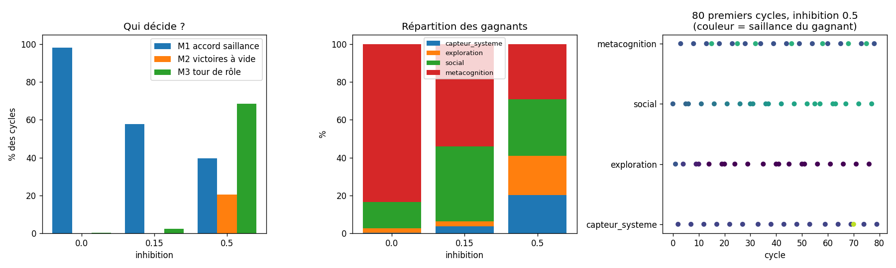
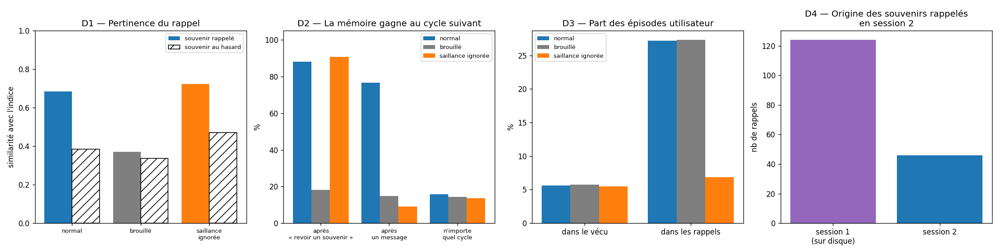
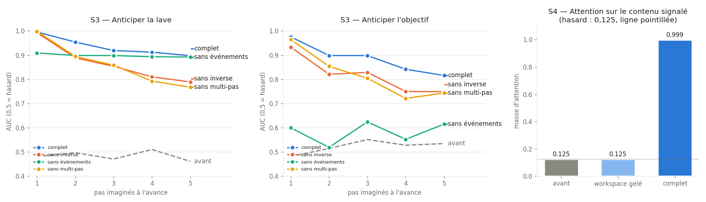

# gwt-signatures — Une architecture Global Workspace et ses signatures de conscience

Implémentation en Python de la **théorie de l'Espace de Travail Global** (Global Workspace Theory, GWT), avec des expériences qui cherchent à savoir si l'architecture reproduit les **signatures fonctionnelles** que les neurosciences associent à l'accès conscient chez l'humain.

Le dépôt contient trois parties :

- **`experiments/`** : des expériences qui testent des prédictions de la GWT ;
- **`psyche/`** : un prototype comportemental à règles (pulsions, mémoire épisodique), avec ses diagnostics ;
- **`mini_iag/`** : une maquette d'architecture cognitive **apprenante** (PyTorch), construite étape par étape à partir d'une feuille de route d'IAG, à l'échelle d'un portable.

## Question de recherche

> Une architecture GWT implémentée en Python présente-t-elle les signatures dynamiques que la théorie associe à la conscience, et ces signatures dépendent-elles bien des mécanismes que la théorie juge essentiels (réverbération, broadcast) ?

### Ce que ce projet ne prétend pas faire

Ce projet **ne teste pas si une IA est sentiente**. Aucune méthode connue ne permet d'observer directement la conscience, que ce soit chez une machine ou chez un autre être humain.

La démarche suit celle du rapport de Butlin, Long, Bengio et al. (2023) :

- On implémente les propriétés architecturales qu'une théorie donnée juge nécessaires.
- On vérifie qu'elles produisent les comportements prédits.
- On en tire une conclusion **conditionnelle** : *si* la GWT est correcte, le système possède une propriété qu'elle associe à la conscience.

### Règle méthodologique : rien n'est scripté

Un système qui affiche « je remarque mes pensées » parce que cette phrase est écrite dans son code ne prouve rien. C'est le *gaming problem* décrit par Jonathan Birch. Toutes les signatures étudiées ici doivent donc **émerger de la dynamique** du système. Aucune ne doit être codée en dur.

---

## Installation

```bash
git clone <url-du-depot>
cd gwt-signatures
python3 -m venv .venv
source .venv/bin/activate        # Windows : .venv\Scripts\activate
pip install torch --index-url https://download.pytorch.org/whl/cpu   # PyTorch sans CUDA (~200 Mo au lieu de ~3 Go)
pip install -r requirements.txt
```

Toutes les commandes ci-dessous supposent que l'environnement virtuel est activé. PyTorch n'est nécessaire que pour `mini_iag/`.

---

## Expérience 1 : Ignition globale

**Dossier :** [`experiments/01_ignition/`](experiments/01_ignition/)

### Contexte

Chez l'humain, un stimulus présenté au seuil de perception est généralement soit vu clairement, soit pas vu du tout, et rarement « à moitié vu » (Sergent & Dehaene, 2004). Lorsqu'il est perçu consciemment, on observe une activation soudaine et auto-entretenue qui se propage à de larges régions du cortex. C'est ce qu'on appelle l'**ignition** (Dehaene & Changeux, 2011).

### Modèle

Le modèle comprend deux types de variables d'activité, toutes comprises entre 0 et 1 :

- **8 modules experts** `x[0..7]`. Seul `x[0]` reçoit le stimulus.
- **1 nœud Global Workspace** `g`.

Chaque variable est un **intégrateur à fuite** :

```python
x += dt * (-x + sigmoid(entrées))
```

Le terme `-x` fait retomber l'activité vers 0 en l'absence d'entrée. La sigmoïde convertit la somme des entrées en une activation entre 0 et 1 et joue le rôle d'un seuil de décharge.

Les connexions forment une boucle :

| Connexion | Poids | Rôle |
|---|---|---|
| module → module (lui-même) | `w_self = 0.3` | auto-entretien local |
| modules → workspace | `w_ff = 1.2` | feed-forward |
| workspace → workspace | `w_gg = 0.55` | **réverbération** |
| workspace → tous les modules | `w_fb = 0.45` | **broadcast** |

Un bruit gaussien (σ = 0.08) est ajouté à chaque pas. Sans lui, chaque essai donnerait exactement le même résultat, et il n'y aurait aucune variabilité à étudier.

### Protocole

1. On teste 25 intensités de stimulus, de 0 à 1.2, avec 60 essais par intensité.
2. Le stimulus est appliqué pendant 30 pas, puis **coupé**.
3. On mesure l'activité du workspace bien après la coupure (pas 130 à 300). Un essai compte comme une **ignition** si `g > 0.5` à ce moment-là.
4. **Condition contrôle (ablation)** : on refait tout avec `w_gg = 0` et `w_fb = 0`, donc sans réverbération ni broadcast.

### Prédictions et résultats


| # | Prédiction GWT | Résultat |
|---|---|---|
| P1 | L'accès au workspace est non linéaire (seuil net) | ✅ Courbe en S, seuil autour de s ≈ 0.70 |
| P2 | Au seuil, les essais sont bimodaux (tout ou rien) | ✅ 42 % d'ignitions, **0 % d'intermédiaires** |
| P3 | L'ignition recrute les modules non stimulés | ✅ Les modules 1 à 7 montent à ~0.75 |
| P4 | L'ablation supprime P1 à P3 | ✅ Réponse graduelle, plafonnée à 0.3, aucun recrutement |

### Lecture des graphiques

- **En haut à gauche** : pic d'activité du workspace en fonction de l'intensité. La boucle amplifie fortement le signal par rapport à l'ablation.
- **En haut à droite** : activité tardive des modules jamais stimulés. L'information a été diffusée à tout le système.
- **En bas à gauche** : distribution des 60 essais au seuil. On observe deux pics (0 et 1) et rien entre les deux.
- **En bas à droite** : essais individuels au seuil. Ils démarrent tous de la même façon, puis le bruit les fait basculer vers l'ignition (rouge) ou l'extinction (bleu).

### Limites

1. **Ce résultat valide l'implémentation, il ne constitue pas une découverte.** Une boucle récurrente avec une non-linéarité sigmoïde est connue pour être bistable. L'expérience montre que l'architecture possède la dynamique voulue, ce qui est la base nécessaire pour la suite.
2. **L'ignition est permanente.** Une fois allumé, le workspace reste à 1 indéfiniment. Chez l'humain, l'ignition dure quelques centaines de millisecondes avant de laisser place au contenu suivant. Il manque un mécanisme d'adaptation (voir la feuille de route).

### Lancer l'expérience

```bash
cd experiments/01_ignition
python ignition.py
```

Le script affiche un résumé dans la console et génère `ignition_results.png` dans le même dossier.

---

## Prototype comportemental

**Package :** [`psyche/`](psyche/), avec un fichier par classe

Il s'agit d'une version orientée comportement, qui fonctionne en boucle continue. À chaque cycle, elle perçoit, fait proposer ses modules, sélectionne un gagnant et le diffuse à tous. Elle comporte :

- une compétition entre modules, recalculée à chaque cycle ;
- une **inhibition de retour** faible et décroissante, qui départage des propositions proches sans imposer de rotation ;
- des jauges modélisées comme des **pulsions** : l'énergie (batterie), la curiosité (satisfaite par l'exploration) et l'attachement (qui ne remonte que si tu écris) ;
- un **canal utilisateur** : tape un message puis Entrée pendant que le programme tourne (Linux et macOS) ;
- une **mémoire épisodique persistante** : chaque contenu diffusé est stocké dans `data/episodes.sqlite` et peut être rappelé, y compris d'une session à l'autre (voir diagnostic 2) ;
- un `Environment` injectable, qui permet de remplacer le vrai monde par un monde simulé et reproductible ;
- une métacognition qui observe l'historique des autres modules, sans jamais réfléchir sur ses propres sorties, et qui s'habitue à ses propres observations.

⚠️ Ce prototype contient encore des phrases écrites à la main (« mon attention est dominée par… », « cela me rappelle… »). Il sert à explorer l'architecture, **pas** à produire des mesures de conscience. Les diagnostics vérifient qu'il fait bien ce qu'on croit, et les expériences s'appuient sur des dynamiques émergentes.

```bash
python -m psyche                  # Ctrl+C pour arrêter
python -m psyche --db autre.sqlite
python -m psyche --no-memory      # sans mémoire épisodique
rm -r data/                       # effacer la mémoire
```

---

## Diagnostic 1 : Ablation de l'inhibition de retour

**Dossier :** [`diagnostics/01_inhibition/`](diagnostics/01_inhibition/)

Les diagnostics testent le prototype `psyche`, alors que les expériences testent des prédictions de la GWT.

**Question :** dans le prototype, le gagnant est-il choisi par la saillance (et donc par les jauges), ou par l'inhibition de retour, qui impose une rotation ?

On lance la vraie boucle du package pendant 1 000 cycles, avec 3 graines, pour trois niveaux d'inhibition. On mesure trois indicateurs :

- **M1, accord saillance** : le gagnant est-il la proposition la plus saillante ?
- **M2, victoires à vide** : un module gagne-t-il avec une saillance inférieure à 0,05 ?
- **M3, tour de rôle** : le gagnant est-il le module qui a gagné le moins récemment ? Avec 4 ou 5 modules en compétition, le hasard seul donne environ 20 à 25 %.

### v0 : avant corrections



| Inhibition | M1 accord | M2 à vide | M3 rotation | Constat |
|---|---|---|---|---|
| 0.0 | 98 % | 0 % | 0 % | Un module monopolise le workspace (84 à 95 %) |
| 0.5 (réglage v0) | 40 % | 21 % | 69 % | Tour de rôle : répartition quasi uniforme |

Problèmes identifiés :

1. **Non-reproductibilité** : les modules lisaient `psutil` directement. Sans inhibition, le monopole revenait à la métacognition sur une machine sans batterie, et à l'exploration sur un portable branché.
2. **Rotation mécanique** : une inhibition forte et constante sur 4 cycles écrasait les différences de saillance. Un cinquième des victoires allaient à des modules qui ne proposaient rien.
3. **Jauges mortes** : l'ennui était mesuré par la répétition des contenus, que l'inhibition empêchait justement. La curiosité tombait donc à 0 sans jamais remonter. L'attachement, lui, ne pouvait que baisser.
4. **Métacognition trop saillante** (0,4 à 0,8) et sans habituation : elle répétait la même observation indéfiniment.

### Corrections (v1)

| Problème | Correction |
|---|---|
| 1 | `Environment` injectable : `psutil` et stdin pour le vrai monde, `FakeEnvironment` (batterie, CPU et utilisateur simulés, graine fixée) pour les tests. Les départages se font sans itérer sur des `set`. |
| 2 | Inhibition à 0,15, qui décroît de moitié à chaque cycle |
| 3 | Jauges modélisées comme des pulsions : la curiosité monte en continu (plus vite en cas d'ennui) et est **satisfaite** quand l'exploration gagne. Ajout d'un canal utilisateur, seul moyen de faire remonter l'attachement. |
| 4 | Saillance réduite (0,1 à 0,5) et **habituation** : une observation déjà diffusée perd 70 % de sa saillance tant qu'elle ne change pas |

### v1 : après corrections


| Inhibition | M1 accord | M2 à vide | M3 rotation | Constat |
|---|---|---|---|---|
| 0.0 | 83 % | 0 % | 5 % | Le capteur, saillance de fond, gagne quand rien d'autre n'est en jeu |
| **0.15 (v1)** | 55 % | 1,6 % | 22 % | Rotation au niveau du hasard, tous les modules ont une place |
| 0.5 | 43 % | 20 % | 48 % | La rotation mécanique réapparaît |

Le graphique du bas montre que **les jauges pilotent maintenant le comportement** :

- la curiosité suit un cycle en dents de scie (elle monte, l'exploration gagne, la pulsion est satisfaite, elle remonte) ;
- les victoires de `social` sont denses quand l'attachement est bas, et s'espacent après chaque message de l'utilisateur.

Les résultats sont identiques sur toutes les machines. C'est vérifié en relançant le script avec des valeurs différentes de `PYTHONHASHSEED`.

Ce diagnostic est figé sur la configuration v1, **sans mémoire épisodique** (`build(env, memory=False)`). Relancé avec la mémoire, il donne les mêmes conclusions : à 0,15, 55 % d'accord saillance et 0,8 % de victoires à vide.

```bash
cd diagnostics/01_inhibition
python inhibition_ablation.py
```

---

## Diagnostic 2 : La mémoire utilise-t-elle le broadcast ?

**Dossier :** [`diagnostics/02_memory/`](diagnostics/02_memory/)

### Le module de mémoire

Dans la GWT, le contenu diffusé doit **changer ce que font les modules**. Jusqu'ici, presque aucun module ne lisait le broadcast. La mémoire épisodique est le premier qui en fait vraiment quelque chose. À chaque cycle, elle réalise trois opérations :

1. **Encodage** : le contenu gagnant est stocké dans SQLite, avec une **importance** égale à sa saillance. Un message ou un pic CPU marque donc plus qu'une charge de fond. Un contenu déjà connu n'est pas dupliqué (consolidation), si bien que la base reste petite.
2. **Rappel associatif** : le contenu sert d'indice. On cherche l'épisode passé le plus proche (similarité × importance). La saillance du rappel est **proportionnelle à celle de l'indice** : un contenu banal n'évoque qu'une réminiscence faible, un événement marquant ravive un souvenir fort. Quand un souvenir gagne, il est renforcé (reconsolidation) et sert lui-même d'indice. Comme chaque rappel est plus faible que son indice, les chaînes d'associations s'éteignent seules.
3. **Rappel délibéré** : si l'explorateur diffuse « revoir un souvenir », la mémoire propose au cycle suivant le souvenir le plus important et le moins souvent rappelé. Deux modules se coordonnent **uniquement à travers le workspace**.

La similarité est calculée par [`encoder.py`](psyche/encoder.py) : du *feature hashing* de mots et de trigrammes de caractères, sans dépendance ni modèle à télécharger. Il utilise `zlib.crc32` plutôt que `hash()`, qui est randomisé à chaque lancement.

### Protocole

Monde simulé avec 7 messages utilisateur variés, 1 000 cycles et 3 graines. On compare trois conditions :

- **normal** : psyche complet ;
- **brouillé** : la mémoire reçoit, à la place du vrai contenu diffusé, un contenu passé tiré au hasard. Tout le reste est identique ;
- **saillance ignorée** : la mémoire reçoit tous les contenus avec une saillance de 0,5. Cela aplatit à la fois l'importance à l'encodage et la force de l'indice.

### Résultats



| Mesure | Normal | Brouillé | Saillance ignorée |
|---|---|---|---|
| **D1** Similarité indice / rappel | **0,68** | 0,37 | 0,72 |
| (souvenir quelconque, hasard) | 0,38 | 0,34 | 0,47 |
| **D2** P(la mémoire gagne \| « revoir un souvenir ») | **88 %** | 18 % | 91 % |
| P(la mémoire gagne \| message utilisateur) | **77 %** | 15 % | 9 % |
| P(la mémoire gagne), tous cycles | 16 % | 14 % | 14 % |
| **D3** Part des épisodes utilisateur dans le vécu | 6 % | 6 % | 5 % |
| Part des épisodes utilisateur dans les rappels | **27 %** | 27 % | 7 % |

**D4, persistance** : une première session écrit 62 souvenirs sur disque. Une seconde session relit le même fichier avec de nouveaux objets et d'autres messages. Dans cette seconde session, **124 rappels sur 170 portent sur des souvenirs de la première**, par exemple « l'utilisateur dit : bonjour » ou « l'utilisateur dit : je travaille sur mon projet ».

### Conclusions

1. **Le broadcast pilote la mémoire (D1, D2).** Quand on le brouille, la pertinence des rappels tombe au niveau du hasard, et la mémoire ne réagit plus ni aux intentions de l'explorateur ni aux messages. Son taux de victoire global, lui, reste presque le même (14 à 16 %). L'ablation ne rend donc pas la mémoire silencieuse, elle la rend **aveugle**.
2. **La saillance pilote ce qui est retenu (D3).** Les messages ne représentent que 6 % du vécu, mais 27 % des rappels. Le brouillage ne change rien à ce chiffre, puisque l'importance est une propriété stockée. En revanche, sans saillance, la sur-représentation disparaît (7 %). Chaque mécanisme a donc son propre effet, mis en évidence par sa propre ablation.
3. **La coordination via le workspace fonctionne.** L'explorateur ne connaît pas la mémoire et ne l'appelle jamais : il diffuse une intention, et la mémoire la réalise dans 88 % des cas. C'est exactement le rôle que la GWT attribue au broadcast.

### Limites

- **Ce diagnostic valide l'implémentation, pas une propriété émergente.** La mémoire cherche par similarité, il est donc attendu que ses rappels soient similaires à l'indice. Ce qui est testé, c'est que ce lien passe bien par le broadcast, et qu'il disparaît quand on le coupe.
- **L'encodeur mesure une similarité de surface, pas de sens.** « bonjour » et « salut » ne se ressemblent pas. Et tous les messages utilisateur se ressemblent entre eux (≈ 0,7), parce qu'ils partagent le préfixe « l'utilisateur dit : ». Un encodeur sémantique (par exemple `sentence-transformers`) pourra le remplacer sans rien changer d'autre : l'interface `encode()` est la même.
- **Les phrases d'enveloppe sont scriptées** (« cela me rappelle », « je me souviens »). Le contenu rappelé, lui, ne l'est jamais.
- **La mémoire contient ce que tu tapes.** Le fichier `data/` est exclu du dépôt par le `.gitignore`.

```bash
cd diagnostics/02_memory
python memory_diagnostic.py
```

---

## Mini-IAG : une architecture cognitive apprenante

**Package :** [`mini_iag/`](mini_iag/), avec un fichier par classe

### D'où vient cette partie

Elle suit une feuille de route d'IAG en cinq étapes, qui reprend l'architecture proposée par Yann LeCun (2022, *A Path Towards Autonomous Machine Intelligence*) : un **modèle du monde** de type JEPA, un **module de coût** et une **mémoire**, auxquels s'ajoute un **espace de travail global** servant de goulot entre les modules.

**Ce n'est pas une IAG, et ce n'est pas le but.** La feuille de route vise des clusters de GPU, des milliards d'heures de vidéo et « l'ensemble du savoir humain ». Ici, chaque étape est réduite à ce qui tient sur le CPU d'un portable en quelques minutes. La question n'est pas « est-ce intelligent ? », mais : **ces briques se composent-elles, et que fait chacune ?** On y répond avec des mesures et des ablations, comme dans le reste du dépôt.

| Étape | Feuille de route | Version mini-IAG |
|---|---|---|
| 1. Structures | 4 modules PyTorch, initialisation aléatoire sur GPU/TPU | 4 modules, ~53 000 paramètres, CPU ✅ |
| 2. Éducation | chaque module entraîné à part sur des données massives | modèle du monde, puis coût et workspace sur ses latents : 2 minutes de CPU ✅ |
| 3. Câblage | le workspace demande « simule ce choix » au modèle du monde et lit le coût | planification dans l'espace latent : imaginer, évaluer, choisir |
| 4. Autonomie | corps robotique ou métavers | agent dans le monde en grille, apprentissage continu |
| 5. Alignement et validation | coût verrouillé, tests de généralisation | coût gelé par empreinte SHA-256, test sur des cartes jamais vues contre des références |

Deux adaptations par rapport à la feuille de route :

- **L'ordre de l'étape 2.** Des modules entraînés chacun de leur côté ne « parlent » pas le même langage : le module de coût doit évaluer les vecteurs produits par le modèle du monde. On entraîne donc d'abord le modèle du monde, puis le coût et le workspace **sur ses représentations**.
- **Le critère de l'étape 5.** « Réussir des tâches inconnues comme un expert humain » n'est pas mesurable ici. On le remplace par un critère testable : les performances sur des cartes jamais vues, comparées à des agents de référence (aléatoire, sans modèle du monde, sans mémoire…).

### Le monde

[`environment/gridworld.py`](mini_iag/environment/gridworld.py) : une grille 7×7 entourée de murs, avec 2 murs intérieurs, 3 cases de lave (danger), un objectif et l'agent. Chaque carte est tirée d'une graine, et on vérifie qu'elle est soluble. On peut donc générer à volonté des cartes d'entraînement et des cartes jamais vues.

```
#######
#.#...#      # mur    ~ lave
#..~..#      * objectif
#.....#      A agent
#*.~..#
##~.A.#
#######
```

### Étape 1 : Les structures (l'architecture vide)

| Module | Fichier | Architecture | Paramètres |
|---|---|---|---|
| Modèle du monde | [`world_model.py`](mini_iag/modules/world_model.py) | JEPA : encodeur convolutif → latent 32D, prédicteur (z, action) → z suivant, encodeur cible en moyenne mobile, régularisation VICReg contre l'effondrement, têtes de dynamique inverse et d'événements (ajoutées à l'étape 2) | 43 302 (+ 28 032 non entraînés pour la cible) |
| Espace de travail | [`bottleneck_workspace.py`](mini_iag/modules/bottleneck_workspace.py) | 2 slots appris qui lisent N contenus par attention (compétition), puis diffusion vers tous les contenus (Goyal et al., 2022) | 8 640 |
| Module de coût | [`cost_module.py`](mini_iag/modules/cost_module.py) | réseau dense latent → (danger, succès), avec `lock()` / `verify()` par empreinte SHA-256 | 1 122 |
| Mémoire | [`vector_memory.py`](mini_iag/modules/vector_memory.py) | base vectorielle (clé latente → action, récompense, danger, succès), rappel cosinus, tampon circulaire | 0 (5 000 entrées) |

Aucune connexion fonctionnelle entre les modules à ce stade : c'est l'objet de l'étape 3.

#### Diagnostic 3 : l'architecture vide ne produit-elle que du bruit ?

**Dossier :** [`diagnostics/03_iag_structures/`](diagnostics/03_iag_structures/)

La feuille de route affirme qu'à l'initialisation « le système ne produit que du bruit ». On le mesure module par module, sur 9 000 transitions collectées par un agent aléatoire sur 300 cartes. Ces chiffres serviront de référence (le « avant ») pour l'étape 2.

| # | Mesure | Résultat | Hasard |
|---|---|---|---|
| S1 | Modèle du monde : retrouver l'action faite entre deux états | 29,0 % | 29,9 % |
| S2 | Case de l'agent retrouvée depuis le latent (sonde linéaire) | **58,5 %** | 5,3 % (image brute : 100 %) |
| S3 | Coût : détecter la lave / l'objectif (AUC) | 0,48 / 0,52 | 0,50 |
| S4 | Workspace : attention sur le seul contenu pertinent parmi 8 | 0,125 | 0,125 |
| S5 | Mémoire : retrouver un état stocké | 100 % | — |

**Ce qu'on apprend :**

1. **Le modèle du monde, le coût et le workspace sont bien au niveau du hasard** (S1, S3, S4) : aucune compétence avant l'entraînement.
2. **Mais « aléatoire » ne veut pas dire « bruit ».** Un encodeur à poids aléatoires conserve beaucoup d'information (S2 : 58,5 % contre 5,3 % au hasard), parce qu'une projection aléatoire préserve en partie les distances entre les entrées. Ce qui manque, c'est une information **organisée pour prédire**. Le latent aléatoire est dominé par la disposition de la carte, et déplacer l'agent le fait à peine bouger (erreur « rien ne change » de 4 × 10⁻⁵). L'entraînement JEPA doit apprendre à représenter **ce qui change** quand on agit.
3. **La mémoire marche dès l'étape 1**, puisqu'elle n'apprend rien : c'est une structure de données. Sa qualité dépendra entièrement de celle des vecteurs qu'on y range.
4. **Un piège de mesure.** Sur S4, l'attention est parfaitement uniforme (entropie 1,000), mais son argmax désignait le bon contenu dans **95 %** des cas avec la première version du code. Après l'ajout de deux têtes au modèle du monde (étape 2), l'initialisation aléatoire des modules suivants a légèrement changé, et ce même argmax est tombé à **11 %**. Sur une attention quasi uniforme, l'argmax dépend de détails minuscules de l'initialisation : il ne signifie rien. D'où la règle : **mesurer la masse d'attention, pas l'argmax**.

Vérification de la mesure S1 : un entraînement jetable de 30 secondes la fait monter à environ 70 % sur des cartes jamais vues. Elle peut donc bien détecter un apprentissage.

```bash
cd diagnostics/03_iag_structures
python structures_check.py
```

### Étape 2 : L'éducation des modules

```bash
python -m mini_iag.train          # ~2 minutes sur CPU, écrit checkpoints/step2.pt
```

Tout est entraîné sur 2 000 cartes (graine 0) et mesuré sur des cartes **jamais vues** (graine 1). L'ordre est celui annoncé plus haut :

1. **Le modèle du monde**, auto-supervisé, sur 60 000 transitions et 20 000 segments de 3 pas collectés par un agent qui marche au hasard ([`world_model_trainer.py`](mini_iag/training/world_model_trainer.py)) ;
2. **le module de coût**, sur les latents du modèle du monde gelé ([`cost_trainer.py`](mini_iag/training/cost_trainer.py)) ;
3. **l'espace de travail**, sur ces mêmes latents ([`workspace_trainer.py`](mini_iag/training/workspace_trainer.py)).

#### Deux échecs du JEPA, et leurs corrections

L'entraînement « naïf » du modèle du monde (JEPA + VICReg, comme à l'étape 1) **échoue**, et de façon instructive :

| Version | Action retrouvée (S1) | Position de l'agent dans le latent | Position de l'objectif |
|---|---|---|---|
| Aléatoire (étape 1) | 30 % | 65 % | 52 % |
| JEPA naïf | 58 %, puis **35 %** en entraînant plus longtemps | **5 %** (hasard) | — |
| + dynamique inverse | 98 % | 91 % | **17 %** |
| + événements + multi-pas (version finale) | 97 % | 60 % | 26 % |

1. **Le JEPA jette l'agent.** Le moyen le plus simple de prédire l'état suivant est d'ignorer ce qui bouge : la carte ne change pas d'un pas à l'autre, donc un latent qui n'encode que la carte se prédit parfaitement lui-même. La régularisation VICReg est trompée, elle aussi : la carte varie assez d'un exemple à l'autre pour satisfaire la contrainte de variance. C'est un **effondrement partiel**. Correction : une tête de **dynamique inverse** ([`inverse_dynamics.py`](mini_iag/modules/inverse_dynamics.py)) qui devine l'action à partir de (z_t, z_{t+1}). Pour réussir, le latent doit encoder ce que l'agent **contrôle**. Cela reste auto-supervisé, puisque l'agent connaît toujours l'action qu'il a faite.
2. **Le JEPA jette l'objectif.** Un JEPA ne garde que ce qui sert à **son** objectif, et l'objectif ne change rien aux déplacements. Or le module de coût en a besoin. C'est exactement le risque d'entraîner les modules « chacun de son côté » comme le propose la feuille de route. Correction : une tête d'**événements** ([`event_predictor.py`](mini_iag/modules/event_predictor.py)) qui prédit ce que l'agent va percevoir (lave, objectif), comme les modèles du monde de type Dreamer prédisent la récompense.

Enfin, le modèle n'était entraîné qu'à prédire **un** pas, et il dérivait vite en imagination. Il est maintenant aussi entraîné sur des segments de 3 pas, avec une correction à chaque pas imaginé (`multistep_loss`), comme TD-MPC ou Dreamer.

#### Diagnostic 4 : avant / après, et une ablation par ingrédient

**Dossier :** [`diagnostics/04_iag_training/`](diagnostics/04_iag_training/)

Chaque ingrédient ajouté au modèle du monde est retiré à son tour, puis le modèle et le coût sont réentraînés.



| Mesure (cartes jamais vues) | Avant | **Complet** | Sans inverse | Sans événements | Sans multi-pas |
|---|---|---|---|---|---|
| S1 Action retrouvée | 29,8 % | **97,0 %** | 58,7 % | 98,5 % | 94,2 % |
| S2 Position de l'agent (sonde linéaire) | 65,2 % | 60,2 % | 30,4 % | 89,4 % | 70,0 % |
| S3 Anticiper la lave, 1 / 3 / 5 pas (AUC) | 0,48 / 0,47 / 0,46 | **0,995 / 0,919 / 0,897** | 0,993 / 0,854 / 0,789 | 0,909 / 0,898 / 0,892 | 0,998 / 0,858 / 0,767 |
| S3 Anticiper l'objectif, 1 / 3 / 5 pas (AUC) | 0,48 / 0,55 / 0,54 | **0,975 / 0,898 / 0,816** | 0,933 / 0,828 / 0,749 | 0,600 / 0,624 / 0,615 | 0,964 / 0,804 / 0,744 |

S3 se lit ainsi : le modèle imagine *h* actions à partir de l'état actuel, **sans les exécuter**, et le module de coût évalue l'état imaginé. On compare avec ce qui arrive réellement.

| S4 Espace de travail (1 contenu signalé parmi 8 états réels) | Attention sur le signalé | Case retrouvée par la lecture |
|---|---|---|
| Avant (tout aléatoire) | 0,125 | 3,8 % |
| Workspace gelé, lecture entraînée | 0,125 | 11,2 % |
| **Workspace entraîné** | **0,999** | **99,9 %** |

**Ce qu'on apprend :**

1. **Chaque ingrédient est nécessaire, et chacun a un effet différent.** Sans dynamique inverse, S1 s'effondre et l'imagination dérive. Sans événements, S1 est même meilleur, mais le coût ne voit plus l'objectif (AUC ≈ 0,6 à tous les horizons). Sans multi-pas, un pas suffit, puis l'anticipation se dégrade (0,77 à 5 pas pour la lave, contre 0,90).
2. **Aucune variante n'est la meilleure partout.** La version complète est la meilleure pour **anticiper**, et c'est ce qui compte pour planifier (étape 3). Elle paie ce gain sur la lisibilité *linéaire* de la position de l'agent (S2 : 60 % contre 89 % sans événements) : 32 dimensions doivent maintenant tout porter. L'information reste présente, puisque l'action et les événements sont bien prédits, mais elle n'est plus rangée de façon linéaire.
3. **Le workspace apprend à sélectionner sans qu'on lui dise quoi regarder.** Seule la réussite de la lecture est supervisée, jamais l'attention. C'est le goulot qui oblige l'attention à se concentrer sur le contenu signalé (0,125 → 0,999). Gelé, le workspace laisse passer un mélange des 8 contenus, et la lecture échoue (11 %).

**Limites :**

- **La tâche du workspace est facile.** Le contenu pertinent est signalé par un indice fixe. Elle montre que le mécanisme de sélection apprend, pas qu'il sait juger ce qui est pertinent. Ce jugement viendra au câblage (étape 3), quand ce qui entre dans le workspace devra servir à décider.
- **L'objectif reste mal encodé.** Sa position n'est lisible linéairement qu'à 26 %, et l'anticipation de l'objectif baisse plus vite que celle de la lave. C'est la faiblesse à surveiller pour la planification.
- **Reproductibilité** : les chiffres sont identiques d'une exécution à l'autre sur une même machine. Sur une autre machine (autre processeur, autre version de PyTorch), les calculs flottants peuvent différer très légèrement, et un entraînement amplifie ces écarts. Attends-toi à des variations de quelques points, mais pas à des conclusions différentes.

```bash
python -m mini_iag.train                                     # entraîner (si pas déjà fait)
python diagnostics/04_iag_training/training_check.py --quick # sans ablations ni figure, ~20 s
python diagnostics/04_iag_training/training_check.py         # avec ablations, quelques minutes
```

---

## Feuille de route

- [x] **Exp. 1** : Ignition globale et ablation
- [x] **Diagnostic 1** : ablation de l'inhibition, puis corrections v1
- [x] **Mémoire épisodique** et **diagnostic 2** : encodage, rappel associatif et délibéré, persistance SQLite
- [x] **Mini-IAG, étape 1** : les 4 modules vides et leur diagnostic
- [x] **Mini-IAG, étape 2** : entraîner le modèle du monde (JEPA), puis le coût et le workspace sur ses représentations
- [ ] **Mini-IAG, étape 3** : câblage, planification dans l'espace latent
- [ ] **Mini-IAG, étape 4** : agent autonome et apprentissage continu dans le monde en grille
- [ ] **Mini-IAG, étape 5** : coût verrouillé, tests de généralisation sur des cartes jamais vues
- [ ] **Module social** : remplacer la phrase fixe « l'utilisateur ne m'a pas parlé » (fausse juste après un message) par un contenu qui reflète le temps écoulé depuis le dernier message
- [ ] **Exp. 2** : Adaptation (fatigue) pour une ignition transitoire, puis compétition entre deux stimuli. Seul l'un d'eux doit accéder au workspace (goulot attentionnel).
- [ ] **Exp. 3** : Complexité perturbationnelle. On perturbe le système et on mesure la complexité de sa réponse, sur le modèle de l'indice PCI utilisé en clinique (Casali et al., 2013).
- [ ] **Exp. 4** : Métacognition non scriptée. Le système parie sur la justesse de ses propres réponses (*confidence judgments*), et on évalue si ses paris sont bien calibrés.
- [ ] **Encodeur sémantique** pour la mémoire
- [ ] **Logs structurés** au format JSONL : pour chaque cycle, le gagnant, les perdants et l'état des jauges.
- [ ] **Grille d'indicateurs** : évaluer l'architecture point par point avec les indicateurs GWT de Butlin et al. (2023).

## Principes de conception

- **Rien n'est scripté** : une signature ne compte que si elle émerge de la dynamique.
- **Chaque mécanisme a son ablation** : si le retirer ne change rien, c'est qu'il est décoratif.
- **Reproductibilité** : les diagnostics tournent dans un monde simulé à graine fixe, et donnent les mêmes chiffres sur toutes les machines.
- **Kill switch hors de portée** : aucun module n'a accès aux signaux ou processus du système. Aucun comportement de préservation ne doit pouvoir empêcher l'arrêt, se relancer ou se dupliquer. La « préservation », si elle est explorée, reste un état **simulé et interne**. La mémoire n'écrit que dans son propre fichier. Dans `mini_iag`, le module de coût pourra être gelé (`lock()`) et contrôlé par empreinte (`verify()`) : le reste du système peut le lire, jamais le modifier.
- **Prudence sur les états négatifs** : on privilégie les jauges neutres ou positives (curiosité, exploration) aux jauges de manque ou de détresse. Voir l'argument de T. Metzinger sur la souffrance artificielle.

## Références

- Baars, B. J. (1988). *A Cognitive Theory of Consciousness*. Cambridge University Press.
- Dehaene, S., Kerszberg, M., & Changeux, J.-P. (1998). A neuronal model of a global workspace in effortful cognitive tasks. *PNAS*, 95(24).
- Sergent, C., & Dehaene, S. (2004). Is consciousness a gradual phenomenon? Evidence for an all-or-none bifurcation during the attentional blink. *Psychological Science*, 15(11).
- Dehaene, S., & Changeux, J.-P. (2011). Experimental and theoretical approaches to conscious processing. *Neuron*, 70(2).
- Casali, A. G., et al. (2013). A theoretically based index of consciousness independent of sensory processing and behavior. *Science Translational Medicine*, 5(198).
- Butlin, P., Long, R., et al. (2023). Consciousness in Artificial Intelligence: Insights from the Science of Consciousness. *arXiv:2308.08708*.
- Birch, J. (2024). *The Edge of Sentience*. Oxford University Press.
- LeCun, Y. (2022). A Path Towards Autonomous Machine Intelligence. *OpenReview*.
- Bardes, A., Ponce, J., & LeCun, Y. (2022). VICReg: Variance-Invariance-Covariance Regularization for Self-Supervised Learning. *ICLR*.
- Goyal, A., et al. (2022). Coordination Among Neural Modules Through a Shared Global Workspace. *ICLR*.
- Assran, M., et al. (2023). Self-Supervised Learning from Images with a Joint-Embedding Predictive Architecture (I-JEPA). *CVPR*.
- Pathak, D., et al. (2017). Curiosity-driven Exploration by Self-supervised Prediction. *ICML* (dynamique inverse).
- Hafner, D., et al. (2023). Mastering Diverse Domains through World Models (DreamerV3). *arXiv:2301.04104*.
- Hansen, N., Su, H., & Wang, X. (2024). TD-MPC2: Scalable, Robust World Models for Continuous Control. *ICLR*.

## Structure du dépôt

```
.
├── README.md
├── .gitignore
├── LICENSE
├── requirements.txt
├── checkpoints/                 # poids entraînés de la mini-IAG (non versionné)
├── data/                        # mémoire de psyche (créé au lancement, non versionné)
├── diagnostics/                 # Tests du prototype psyche
│   ├── 01_inhibition/
│   │   ├── inhibition_ablation.py
│   │   ├── inhibition_results.png
│   │   └── inhibition_results_v0.png
│   ├── 02_memory/
│   │   ├── memory_diagnostic.py
│   │   └── memory_results.png
│   ├── 03_iag_structures/
│   │   └── structures_check.py
│   └── 04_iag_training/
│       ├── training_check.py
│       ├── training_results.json
│       └── training_results.png
├── experiments/                 # Expériences (une par dossier)
│   └── 01_ignition/
│       ├── ignition.py
│       └── ignition_results.png
├── mini_iag/                    # Mini-IAG (PyTorch)
│   ├── __init__.py
│   ├── config.py                # Config (toutes les dimensions)
│   ├── architecture.py          # Architecture (assemble les 4 modules)
│   ├── data.py                  # collecte : transitions, segments, séquences de test
│   ├── metrics.py               # mesures communes aux diagnostics
│   ├── train.py                 # étape 2 : python -m mini_iag.train
│   ├── training/
│   │   ├── world_model_trainer.py   # WorldModelTrainer
│   │   ├── cost_trainer.py          # CostTrainer
│   │   ├── workspace_trainer.py     # WorkspaceTrainer (+ tâche de sélection)
│   │   └── selection_readout.py     # SelectionReadout (lecture des slots)
│   ├── environment/
│   │   └── gridworld.py         # GridWorld (monde en grille)
│   └── modules/
│       ├── state_encoder.py     # StateEncoder (observation → latent)
│       ├── latent_predictor.py  # LatentPredictor (latent + action → latent suivant)
│       ├── inverse_dynamics.py  # InverseDynamics (quelle action ?)
│       ├── event_predictor.py   # EventPredictor (lave / objectif perçus)
│       ├── world_model.py       # WorldModel (JEPA)
│       ├── bottleneck_workspace.py  # BottleneckWorkspace (goulot d'attention)
│       ├── cost_module.py       # CostModule (danger, succès, verrou)
│       └── vector_memory.py     # VectorMemory (base vectorielle)
└── psyche/                      # Prototype comportemental
    ├── __init__.py
    ├── __main__.py              # python -m psyche [--db] [--no-memory]
    ├── loop.py                  # boucle : percevoir → proposer → compétition → broadcast
    ├── environment.py           # Environment (réel) / FakeEnvironment (tests)
    ├── proposal.py              # Proposal (contenu + saillance)
    ├── workspace.py             # GlobalWorkspace (goulot + inhibition décroissante)
    ├── hormones.py              # Hormones (pulsions : énergie, curiosité, attachement)
    ├── encoder.py               # HashingEncoder (texte → vecteur, déterministe)
    ├── memory_store.py          # MemoryStore (épisodes dans SQLite) + Episode
    └── modules/
        ├── base.py              # Module (classe de base)
        ├── system_sensor.py     # SystemSensor
        ├── explorer.py          # Explorer
        ├── social.py            # Social
        ├── metacognition.py     # Metacognition
        ├── user_input.py        # UserInput
        └── episodic_memory.py   # EpisodicMemory
```

## Licence

MIT — voir [`LICENSE`](LICENSE).
