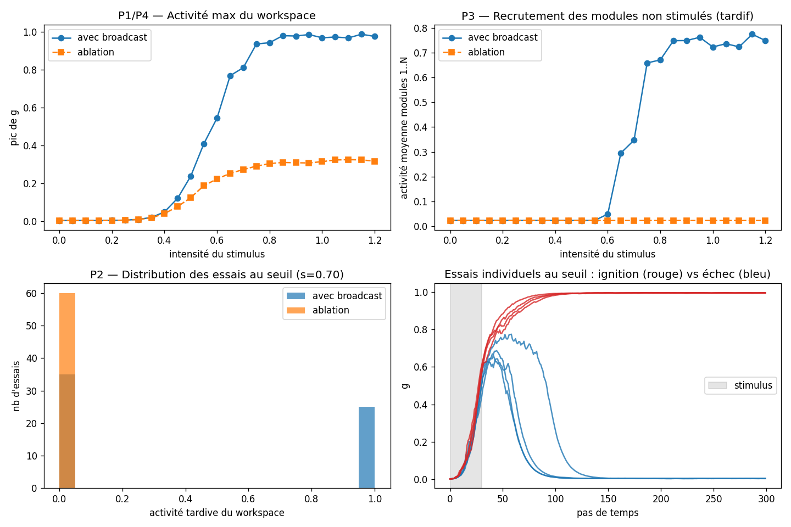
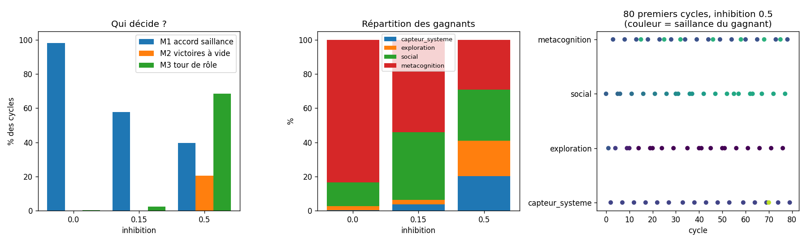

# psyche — Une architecture Global Workspace et ses signatures de conscience

Implémentation en Python de la **théorie de l'Espace de Travail Global** (Global Workspace Theory, GWT), avec des expériences qui cherchent à savoir si l'architecture reproduit les **signatures fonctionnelles** que les neurosciences associent à l'accès conscient chez l'humain.

## Question de recherche

> Une architecture GWT implémentée en Python présente-t-elle les signatures dynamiques que la théorie associe à la conscience, et ces signatures dépendent-elles bien des mécanismes que la théorie juge essentiels (réverbération, broadcast) ?

### Ce que ce projet ne prétend pas faire

Ce projet **ne teste pas si une IA est sentiente**. Aucune méthode connue ne permet d'observer directement la conscience, que ce soit chez une machine ou chez un autre être humain.

La démarche suit celle du rapport de Butlin, Long, Bengio et al. (2023) :

- On implémente les propriétés architecturales qu'une théorie donnée juge nécessaires.
- On vérifie qu'elles produisent les comportements prédits.
- On en tire une conclusion **conditionnelle** : *si* la GWT est correcte, le système possède une propriété qu'elle associe à la conscience.

### Règle méthodologique : rien n'est scripté

Un système qui affiche « je remarque mes pensées » parce que cette phrase est écrite dans son code ne prouve rien. C'est le *gaming problem* décrit par Jonathan Birch. Toutes les signatures étudiées ici doivent donc **émerger de la dynamique** du système. Aucune ne doit être codée en dur.

## Installation

```bash
git clone <url-du-depot>
cd psyche
python3 -m venv .venv
source .venv/bin/activate        # Windows : .venv\Scripts\activate
pip install -r requirements.txt
```

Toutes les commandes ci-dessous supposent que l'environnement virtuel est activé.

---

## Expérience 1 : Ignition globale

**Dossier :** [`experiments/01_ignition/`](experiments/01_ignition/)

### Contexte

Chez l'humain, un stimulus présenté au seuil de perception est généralement soit vu clairement, soit pas vu du tout, et rarement « à moitié vu » (Sergent & Dehaene, 2004). Lorsqu'il est perçu consciemment, on observe une activation soudaine et auto-entretenue qui se propage à de larges régions du cortex. C'est ce qu'on appelle l'**ignition** (Dehaene & Changeux, 2011).

### Modèle

Le modèle comprend deux types de variables d'activité, toutes comprises entre 0 et 1 :

- **8 modules experts** `x[0..7]`. Seul `x[0]` reçoit le stimulus.
- **1 nœud Global Workspace** `g`.

Chaque variable est un **intégrateur à fuite** :

```python
x += dt * (-x + sigmoid(entrées))
```

Le terme `-x` fait retomber l'activité vers 0 en l'absence d'entrée. La sigmoïde convertit la somme des entrées en une activation entre 0 et 1 et joue le rôle d'un seuil de décharge.

Les connexions forment une boucle :

| Connexion | Poids | Rôle |
|---|---|---|
| module → module (lui-même) | `w_self = 0.3` | auto-entretien local |
| modules → workspace | `w_ff = 1.2` | feed-forward |
| workspace → workspace | `w_gg = 0.55` | **réverbération** |
| workspace → tous les modules | `w_fb = 0.45` | **broadcast** |

Un bruit gaussien (σ = 0.08) est ajouté à chaque pas. Sans lui, chaque essai donnerait exactement le même résultat, et il n'y aurait aucune variabilité à étudier.

### Protocole

1. On teste 25 intensités de stimulus, de 0 à 1.2, avec 60 essais par intensité.
2. Le stimulus est appliqué pendant 30 pas, puis **coupé**.
3. On mesure l'activité du workspace bien après la coupure (pas 130 à 300). Un essai compte comme une **ignition** si `g > 0.5` à ce moment-là.
4. **Condition contrôle (ablation)** : on refait tout avec `w_gg = 0` et `w_fb = 0`, donc sans réverbération ni broadcast.

### Prédictions et résultats



| # | Prédiction GWT | Résultat |
|---|---|---|
| P1 | L'accès au workspace est non linéaire (seuil net) | ✅ Courbe en S, seuil autour de s ≈ 0.70 |
| P2 | Au seuil, les essais sont bimodaux (tout ou rien) | ✅ 42 % d'ignitions, **0 % d'intermédiaires** |
| P3 | L'ignition recrute les modules non stimulés | ✅ Les modules 1 à 7 montent à ~0.75 |
| P4 | L'ablation supprime P1 à P3 | ✅ Réponse graduelle, plafonnée à 0.3, aucun recrutement |

### Lecture des graphiques

- **En haut à gauche** : pic d'activité du workspace en fonction de l'intensité. La boucle amplifie fortement le signal par rapport à l'ablation.
- **En haut à droite** : activité tardive des modules jamais stimulés. L'information a été diffusée à tout le système.
- **En bas à gauche** : distribution des 60 essais au seuil. On observe deux pics (0 et 1) et rien entre les deux.
- **En bas à droite** : essais individuels au seuil. Ils démarrent tous de la même façon, puis le bruit les fait basculer vers l'ignition (rouge) ou l'extinction (bleu).

### Limites

1. **Ce résultat valide l'implémentation, il ne constitue pas une découverte.** Une boucle récurrente avec une non-linéarité sigmoïde est connue pour être bistable. L'expérience montre que l'architecture possède la dynamique voulue, ce qui est la base nécessaire pour la suite.
2. **L'ignition est permanente.** Une fois allumé, le workspace reste à 1 indéfiniment. Chez l'humain, l'ignition dure quelques centaines de millisecondes avant de laisser place au contenu suivant. Il manque un mécanisme d'adaptation (voir la feuille de route).

### Lancer l'expérience

```bash
cd experiments/01_ignition
python ignition.py
```

Le script affiche un résumé dans la console et génère `ignition_results.png` dans le même dossier.

---

## Prototype comportemental

**Package :** [`psyche/`](psyche/), avec un fichier par classe

Il s'agit d'une première version orientée comportement, qui fonctionne en boucle continue. Elle comporte :

- une compétition entre modules, recalculée à chaque cycle ;
- une **inhibition de retour**, qui pénalise un contenu ou un module ayant gagné récemment pour empêcher la monopolisation du workspace ;
- des jauges homéostatiques : l'énergie (liée à la batterie via `psutil`), la curiosité (qui monte quand les pensées se répètent) et l'attachement ;
- une métacognition qui observe l'historique des autres modules, sans jamais réfléchir sur ses propres sorties, pour éviter une récursion infinie.

⚠️ Ce prototype contient encore des phrases écrites à la main (« mon attention est dominée par… »). Il sert à explorer l'architecture, **pas** à produire des mesures. Les expériences, elles, s'appuient sur des dynamiques émergentes.

```bash
python -m psyche   # Ctrl+C pour arrêter
```

---

## Diagnostic 1 : Ablation de l'inhibition de retour

**Dossier :** [`diagnostics/01_inhibition/`](diagnostics/01_inhibition/)

Les diagnostics testent le prototype `psyche`, alors que les expériences testent des prédictions de la GWT.

**Question :** dans le prototype, le gagnant est-il choisi par la saillance (et donc par les jauges), ou par l'inhibition de retour, qui impose une rotation ?

On lance la vraie boucle du package pendant 1 000 cycles, avec 3 graines, pour trois niveaux d'inhibition. On mesure trois indicateurs :

- **M1, accord saillance** : le gagnant est-il la proposition la plus saillante ?
- **M2, victoires à vide** : un module gagne-t-il avec une saillance inférieure à 0,05 ?
- **M3, tour de rôle** : le gagnant est-il le module qui a gagné le moins récemment ?



| Inhibition | M1 accord | M2 à vide | M3 rotation | Constat |
|---|---|---|---|---|
| 0.0 | 98 % | 0 % | 0 % | La métacognition monopolise 84 % des cycles |
| 0.15 | 58 % | 0 % | 2 % | Social et métacognition occupent 94 % des cycles |
| 0.5 (actuel) | 40 % | 21 % | 69 % | Tour de rôle : répartition quasi uniforme |

**Conclusions :**

1. Le réglage actuel (0.5) produit surtout une rotation mécanique. Un cinquième des victoires vont à des modules qui ne proposent rien.
2. Sans inhibition, le bug du plan initial revient : la métacognition, dont la saillance est structurellement élevée, monopolise le workspace.
3. À 0.15, la saillance décide de nouveau, mais les jauges s'effondrent (curiosité → 0, attachement → 0). Les modules `exploration` et `capteur_systeme` sont alors presque absents.

Le problème ne se règle donc pas avec l'inhibition seule. Il faut aussi corriger la dynamique des jauges et la saillance de la métacognition.

```bash
cd diagnostics/01_inhibition
python inhibition_ablation.py
```

---

## Feuille de route

- [x] **Exp. 1** : Ignition globale et ablation
- [ ] **Exp. 2** : Adaptation (fatigue) pour une ignition transitoire, puis compétition entre deux stimuli. Seul l'un d'eux doit accéder au workspace (goulot attentionnel).
- [ ] **Exp. 3** : Complexité perturbationnelle. On perturbe le système et on mesure la complexité de sa réponse, sur le modèle de l'indice PCI utilisé en clinique (Casali et al., 2013).
- [ ] **Exp. 4** : Métacognition non scriptée. Le système parie sur la justesse de ses propres réponses (*confidence judgments*), et on évalue si ses paris sont bien calibrés.
- [ ] **Mémoire épisodique** : stockage des contenus diffusés dans SQLite avec embeddings, et rappel par similarité.
- [ ] **Logs structurés** au format JSONL : pour chaque cycle, le gagnant, les perdants et l'état des jauges.
- [ ] **Grille d'indicateurs** : évaluer l'architecture point par point avec les indicateurs GWT de Butlin et al. (2023).

## Principes de conception

- **Rien n'est scripté** : une signature ne compte que si elle émerge de la dynamique.
- **Chaque mécanisme a son ablation** : si le retirer ne change rien, c'est qu'il est décoratif.
- **Kill switch hors de portée** : aucun module n'a accès aux signaux ou processus du système. Aucun comportement de préservation ne doit pouvoir empêcher l'arrêt, se relancer ou se dupliquer. La « préservation », si elle est explorée, reste un état **simulé et interne**.
- **Prudence sur les états négatifs** : on privilégie les jauges neutres ou positives (curiosité, exploration) aux jauges de manque ou de détresse. Voir l'argument de T. Metzinger sur la souffrance artificielle.

## Références

- Baars, B. J. (1988). *A Cognitive Theory of Consciousness*. Cambridge University Press.
- Dehaene, S., Kerszberg, M., & Changeux, J.-P. (1998). A neuronal model of a global workspace in effortful cognitive tasks. *PNAS*, 95(24).
- Sergent, C., & Dehaene, S. (2004). Is consciousness a gradual phenomenon? Evidence for an all-or-none bifurcation during the attentional blink. *Psychological Science*, 15(11).
- Dehaene, S., & Changeux, J.-P. (2011). Experimental and theoretical approaches to conscious processing. *Neuron*, 70(2).
- Casali, A. G., et al. (2013). A theoretically based index of consciousness independent of sensory processing and behavior. *Science Translational Medicine*, 5(198).
- Butlin, P., Long, R., et al. (2023). Consciousness in Artificial Intelligence: Insights from the Science of Consciousness. *arXiv:2308.08708*.
- Birch, J. (2024). *The Edge of Sentience*. Oxford University Press.

## Structure du dépôt

```
.
├── README.md
├── .gitignore
├── LICENSE
├── requirements.txt
├── diagnostics/             # Tests du prototype psyche
│   └── 01_inhibition/
│       ├── inhibition_ablation.py
│       └── inhibition_results.png
├── experiments/             # Expériences (une par dossier)
│   └── 01_ignition/
│       ├── ignition.py
│       └── ignition_results.png
└── psyche/                  # Prototype comportemental
    ├── __init__.py
    ├── __main__.py          # python -m psyche
    ├── loop.py              # boucle : proposer → compétition → broadcast
    ├── proposal.py          # Proposal (contenu + saillance)
    ├── workspace.py         # GlobalWorkspace (goulot + inhibition de retour)
    ├── hormones.py          # Hormones (énergie, curiosité, attachement)
    └── modules/
        ├── base.py          # Module (classe de base)
        ├── system_sensor.py # SystemSensor
        ├── explorer.py      # Explorer
        ├── social.py        # Social
        └── metacognition.py # Metacognition
```

## Licence

MIT — voir [`LICENSE`](LICENSE).
